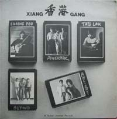

| 香港 | 香港 |
| --- | --- |
|  | |
| 結他比賽五組優勝組合冠軍的合輯 | 結他比賽五組優勝組合冠軍的合輯 |
| 發行日期 | 1984年9月 |
| 類型 | 搖滾 |
| 唱片公司 | 郭達年 |

《**香港結他比賽冠軍精英輯**》是黑鳥樂隊主音郭達年的《結他雜誌》於1983年舉辦「Guitar Players Festival 結他大賽」[^1]（又名「山葉結他比賽」）後，集合五個優勝組合推出的黑膠唱片合輯，主要訴說香港音樂人徘徊於**商業**和**藝術**的分裂。

這次結他比賽對香港搖滾樂壇影響深遠，各參賽者後來成為香港樂壇之中流砥柱，包括冠軍隊伍<ContentLink uid="wiki/beyond">Beyond</ContentLink>、達明一派的劉以達及太極樂隊的低音結他手盛旦華（POWERPAK），還有爵士樂手包以正。

## 比賽

比賽由1982年12月開始分多天進行，約有70隊樂隊參加，樂隊需要以原創作品參賽，當中只有10隊可以晉級進入決賽。[^1]

決賽在1983年3月6日在香港藝術中心壽臣劇院舉行。

## 比賽結果

比賽只設冠軍一個獎項。[^1]

-   冠軍（Best Group Award[^1]）：腦部侵襲 BRAIN ATTACK（<ContentLink uid="wiki/beyond">BEYOND</ContentLink>：<ContentLink uid="wiki/黃家駒">黃家駒</ContentLink>、<ContentLink uid="wiki/葉世榮">葉世榮</ContentLink>）

## 曲目

1.  BOSS NO GO GO（POWERPAK：David Ling）
1.  WEAR N' TEAR（包以正）
1.  腦部侵襲 BRAIN ATTACK（<ContentLink uid="wiki/beyond">BEYOND</ContentLink>：<ContentLink uid="wiki/黃家駒">黃家駒</ContentLink>、<ContentLink uid="wiki/葉世榮">葉世榮</ContentLink>）
1.  中國女孩 CHINA GIRL（劉以達）
1.  ICE IN THE FLAME（Ancient）
1.  GANG BANG（POWERPAK：David Ling）
1.  TAPESTRY（包以正）
1.  大廈 BUILDING（<ContentLink uid="wiki/beyond">BEYOND</ContentLink>：<ContentLink uid="wiki/黃家駒">黃家駒</ContentLink>、鄧煒謙、<ContentLink uid="wiki/葉世榮">葉世榮</ContentLink>）
1.  紅衛兵 RED ARMY（劉以達）
1.  THE BODY N' THE FLESH（Ancient）

## 附註

1.  《我與BEYOND的日子》2010年 鄧煒謙著

## 外部連結

-   [Beyond - 腦部侵襲](https://www.youtube.com/watch?v=ZFi1lhx9DJ0) （[頁面存檔備份](//web.archive.org/web/20160412035107/http://www.youtube.com/watch?v=ZFi1lhx9DJ0)，存於互聯網檔案館）
-   [Beyond - 大廈](https://www.youtube.com/watch?v=ctc-v-nwcik) （[頁面存檔備份](//web.archive.org/web/20200420032145/https://www.youtube.com/watch?v=ctc-v-nwcik)，存於互聯網檔案館）

[^1]: 《我與BEYOND的日子》2010年 鄧煒謙著
