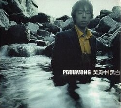

| 黑白 | 黑白 |
| --- | --- |
|  | |
| <ContentLink uid="wiki/黃貫中">黃貫中</ContentLink>的錄音室專輯 | <ContentLink uid="wiki/黃貫中">黃貫中</ContentLink>的錄音室專輯 |
| 發行日期 | 2001年12月13日 |
| 類型 | 搖滾、粵語流行音樂 |
| 唱片公司 | 環球唱片 |
| <ContentLink uid="wiki/黃貫中">黃貫中</ContentLink>專輯年表 | <ContentLink uid="wiki/黃貫中">黃貫中</ContentLink>專輯年表 |

| <ContentLink uid="wiki/yellow-paul-wong">Yellow Paul Wong</ContentLink> （2001年） | **黑白** （2001年） | Play It Loud （2002年） |
| --- | --- | --- |

《**黑白**》是香港歌手<ContentLink uid="wiki/黃貫中">黃貫中</ContentLink>發行第二張粵語專輯。

## 專輯介紹

《黑白》比起上一張專輯從世界各地邀來的眾多客座樂手的狀況來看，這張專輯就沒有那麼熱鬧了，風格也較趨統一。以黃貫中為主腦的汗，成員包括很黑人、很groovy的鼓手恭碩良；手法較唯美和爵士的結他手夏健龍以及黃貫中的多年好友-LMF的低音結他手麥文威。帶着英式搖滾曲風的音樂中展現了黃貫中特有的憂鬱美學。

## 曲目

1.  初哥
1.  Lady
1.  深紫色高踭鞋
1.  爆
1.  自由人(獨唱版)
1.  離開我吧
1.  憂書
1.  自由人(合唱：譚詠麟)
1.  你懂不懂
