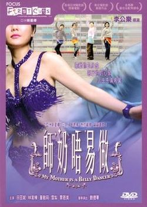

| 师奶唔易做   *My Mother Is a Belly Dancer* | 师奶唔易做   *My Mother Is a Belly Dancer* |
| --- | --- |
|  | |
| 基本资料 | 基本资料 |
| 导演 | 李公乐 |
| 监制 | 余伟国 黄精甫 |
| 制片 | 谭静颜 |
| 编剧 | 海燕 李敏 |
| 主演 | 田蕊妮 雪梨 董敏莉 林家栋 |
| 配乐 | <ContentLink uid="wiki/黃貫中">黄贯中</ContentLink> |
| 摄影 | 关智耀 |
| 剪辑 | 余伟国 张健鸿 |
| 制片商 | 映艺娱乐有限公司 |
| 片长 | 104 分钟 |
| 产地 | 香港 |
| 语言 | 粤语 |
| 上映及发行 | 上映及发行 |
| 上映日期 | 香港：- 2006年11月9日  新加坡：2007年1月25日 |
| 票房 | HK $233,918.00 |
| 各地片名 | 各地片名 |
| 中国大陆 | 疯狂主妇 |
| 香港 | 师奶唔易做 |
| 台湾 | 师奶难为 |

**《师奶唔易做》**（英语：*My Mother Is a Belly Dancer*）是一部2006年刘德华投资的香港电影。李公乐导演，田蕊妮和雪梨主演。"师奶"一词是指典型的家庭主妇[^1][^2]。

## 剧情简介

讲述几位家庭主妇力排丈夫反对的声音，共同加入学习性感的肚皮舞从而重拾自我的故事。

## 演员表

| **演员** | **角色** |
| --- | --- |
| 田蕊妮 | 黄太，失业妇人，与丈夫有四个女儿 |
| 雪梨 | 李太，有一个儿子 |
| 董敏莉 | Cherry，未婚妈妈 |
| 覃恩美 | 陈太，有一个女儿，丈夫在外面有婚外情 |
| 林家栋 | 黄生，黄太的老公 |
| 汤镇业 | 李生，李太的老公 |
| 林子聪 | 肥仔忠，Cherry的前男友，两人有一个儿子 |
| 薛立贤 | 李学良 |
| 刘海仪 | 黄家大女 |
| 陈小慧 | 黄家二女 |
| 陈靖琳 | 黄家三女 |
| 陈诗慧 | 黄家四女 |
| 张颕康 | Ken |
| 刘德华 | 餐厅老板 |
| 黎伟明 | 李生朋友 |

## 创作

李公乐在谈起拍摄本片的缘由时说：“有次和朋友茶聚，他介绍位肚皮舞老师给我认识，说老实话，这位老师不是美女，但很奇怪，她一跳起肚皮舞，立即光芒四射，后来我去看肚皮舞班上课，学生高矮肥瘦甚么人都有。一班骤看很普通的人，随音乐起舞，便像有团光发放似的，我觉得这种光是来自她们的自信，于是想出这个故事。”他表示本片的主旨是讲述人们如何在生活中寻找出路的[^3]。

## 奖项

| 颁奖典礼 | 奖项 | 名单 | 结果 |
| --- | --- | --- | --- |
| 第43届金马奖 | 最佳女配角 | 覃恩美 | 提名 |
| 第26届香港电影金像奖 | 最佳女配角 | 田蕊妮 | 提名 |

## 参考资料

## 外部链接

-   开眼电影网上《[师奶唔易做](http://app2.atmovies.com.tw/film/fmhk40819794)》的资料（繁体中文）
-   香港影库上《[师奶唔易做](https://hkmdb.com/db/movies/view.mhtml?id=11940&display_set=big5)》的资料（繁体中文）
-   时光网上《[师奶唔易做](http://movie.mtime.com/48147/)》的资料（简体中文）
-   豆瓣电影上《[师奶唔易做](https://movie.douban.com/subject/1813966/)》的资料 （简体中文）
-   烂番茄上《[师奶唔易做](https://www.rottentomatoes.com/m/seelai-ng-yi-cho-my-mother-is-a-belly-dancer)》的资料（英文）
-   AllMovie上《[师奶唔易做](https://www.allmovie.com/movie/v392727)》的资料（英文）
-   互联网电影数据库（IMDb）上《[师奶唔易做](https://www.imdb.com/title/tt0819794/)》的资料（英文）

[^1]: [师奶唔易做](https://web.archive.org/web/20140201221037/http://epaper.oeeee.com/E/html/2008-03/05/content_399602.htm). 南方都市报. 2008年3月5日. （[原始内容](http://epaper.oeeee.com/E/html/2008-03/05/content_399602.htm)存档于2014年2月1日）.

[^2]: [师奶唔易做](https://web.archive.org/web/20140201222226/http://lady.southcn.com/reai/youh/content/2007-07/16/content_4207692_7.htm). 南方都市报网络版. 2007-07-16. （[原始内容](http://lady.southcn.com/reai/youh/content/2007-07/16/content_4207692_7.htm)存档于2014-02-01）.

[^3]: [疯狂主妇幕后花絮](https://archive.today/20120731095448/http://www.funshion.com/subject/feature/36303/). 风行. （[原始内容](http://www.funshion.com/subject/feature/36303/)存档于2012-07-31）.
