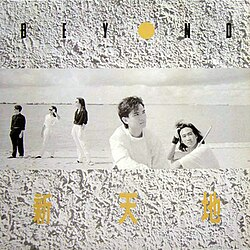

| 新天地 | 新天地 |
| --- | --- |
|  | |
| <ContentLink uid="wiki/beyond">Beyond</ContentLink>的EP | <ContentLink uid="wiki/beyond">Beyond</ContentLink>的EP |
| 发行日期 | 1987年8月 |
| 录制时间 | Kinn's Music Ltd. |
| 类型 | 摇滚、粤语流行音乐 |
| 唱片公司 | Kinn's Music Ltd. |
| <ContentLink uid="wiki/beyond">Beyond</ContentLink>专辑年表 | <ContentLink uid="wiki/beyond">Beyond</ContentLink>专辑年表 |

| <ContentLink uid="wiki/永遠等待">永远等待</ContentLink> （1987年） | **新天地** （1987年） | 旧日的足迹 （1988年） |
| --- | --- | --- |

《**新天地**》是著名香港摇滚乐队<ContentLink uid="wiki/beyond">Beyond</ContentLink>发行第二张EP，《新天地》以主打五曲EP，《昔日舞曲》两个混音版和重灌《东方宝藏》英文版《Long Way Without Friends》，《新天地》12吋单曲在1987年8月推出，《东方宝藏》除了向电台推荐为Beyond第一张专辑《<ContentLink uid="wiki/亞拉伯跳舞女郎">亚拉伯跳舞女郎</ContentLink>》的第一首主打歌以外，当时市场对12吋单曲有一定的需求，决定把《新天地》以12吋单曲推出。

1994年以CD单曲方式推出，曲目上放弃原有的《东方宝藏》和《昔日舞曲》的新混音版本，后来《东方宝藏》纯音乐版以CD推出。

## 曲目

1.  新天地
1.  东方宝藏
1.  昔日舞曲(新混音版本)
1.  昔日舞曲(仿古混音版本)
1.  Long Way Without Friends
