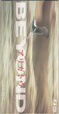

| アリガトウ c/w 祝您愉快 | アリガトウ c/w 祝您愉快 |
| --- | --- |
|  | |
| <ContentLink uid="wiki/beyond">Beyond</ContentLink>的歌曲 | <ContentLink uid="wiki/beyond">Beyond</ContentLink>的歌曲 |
| 发行日期 | 1995年3月15日 |
| 类型 | 日本流行音乐 |
| 唱片公司 | Fun House |
| <ContentLink uid="wiki/beyond">Beyond</ContentLink>单曲年表 | <ContentLink uid="wiki/beyond">Beyond</ContentLink>单曲年表 |

| <ContentLink uid="wiki/paradise-beyond單曲">Paradise</ContentLink> （1994年） | **アリガトウ c/w 祝您愉快**  （1995年） | |
| --- | --- | --- |

《**アリガトウ c/w 祝您愉快**》是香港摇滚乐队<ContentLink uid="wiki/beyond">Beyond</ContentLink>发行第五张日本单曲，《总有爱》日语版本，歌名取为《アリガトウ》，为多谢的意思，是感谢这几年日本乐迷的支持；虽然日本对Beyond来说是一个无法忘怀的伤心地...

第二首歌曲收录来自于《<ContentLink uid="wiki/二樓後座">二楼后座</ContentLink>》的《祝您愉快》，在Beyond要退出日本市场的最后单曲内收录纪念黄家驹的歌曲。

## 曲目

1.  アリガトウ
1.  祝您愉快
