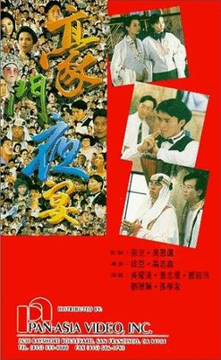

| 豪门夜宴   *The Banquet* | 豪门夜宴   *The Banquet* |
| --- | --- |
|  | |
| 基本资料 | 基本资料 |
| 导演 | 张坚庭 张同祖 高志森 徐克 |
| 监制 | 吴思远 岑建勋 |
| 制片 | 林慧霞、曹敬文、谭德祥 刘思乐、彭绮华 |
| 编剧 | 徐小明 王晶 徐克 高志森 陈嘉上 司徒慧焯 曾志伟 黄炳耀 蔡婷婷 |
| 主演 | 曾志伟 郑裕玲 吴耀汉 洪金宝 关之琳 梁家辉 梁朝伟 岑建勋 张学友 |
| 配乐 | 卢冠廷 |
| 摄影 | 林国华 李健强 黄永恒 刘伟强 鲍德熹 李德伟 锺志文 |
| 剪辑 | 胡大为、麦子善 金马、少峰 |
| 制片商 | 演艺界忘我大电影有限公司 |
| 片长 | 97分钟 |
| 产地 | 英属香港 |
| 语言 | 粤语 |
| 上映及发行 | 上映及发行 |
| 上映日期 | 英属香港：- 1991年11月30日 |
| 发行商 | 永高影片发行有限公司 |
| 票房 | 英属香港：HK$ 21,921,687.00 |

《**豪门夜宴**》（英语：**The Banquet**），是1991年的一部为赈济1991年华东水灾而以极短时间构思和拍摄的“**香港演艺界忘我大电影**”[^1]，改编自1959年的同名粤语长片。当时香港大部分知名艺人都在本片中出现，可以说是一部“全明星”出演的电影，本片亦是徐克和张坚庭唯一一部联合执导的电影。有趣的是，虽然有周星驰免费出演，但是本片和1991年的其他周星驰电影相比，票房偏低。2018年10月27日为世界视听遗产日，澳门影视制作文化协会及国际电影电视和试听交流理事会在澳门的恋爱电影馆播放此电影的复刻版[^2]。

此外，本片是目前唯一一套集合5位港姐冠军（梁韵蕊、谢宁、杨宝玲、李嘉欣、陈法蓉）+1位亚军（张曼玉）共同参与演出的电影。

## 制作人员

-   筹备委员：吴思远、岑建勋、施南生、梁李少霞、张同祖、张国忠、曾志伟
-   改编剧本：王晶、徐克、司徒慧焯、徐小明、陈嘉上、高志森、黄炳耀、蔡婷婷、曾志伟
-   摄影指导：刘伟强、鲍德熹、黄永恒、锺志文、林国华、李健强、李德伟、谈智伟
-   剪接：胡大为、麦子善、少峰、金马
-   美术指导：马磐超
-   原创音乐：卢冠廷
-   导演：徐克、张坚庭、张同祖、高志森

## 演员名单

### 主要演员

| **演员** | **角色** | **备注** | **1959年版原型角色[^3]** |
| --- | --- | --- | --- |
| 曾志伟 | 曾小智 | 领衔主演，剧中主人翁 | 冯绥仁（吴楚帆饰） |
| 郑裕玲 | MIMI | 领衔主演，曾小智妻子 | 冯太太（梅绮饰） |
| 吴耀汉 | 曾伯 | 领衔主演，曾小智父亲，科威特王子老友及救命恩人 | 冯父（林坤山饰） |
| 洪金宝 | 洪大宝 | 主演，曾小智的商业对手 | 何老大（卢敦饰） |
| 关之琳 | 阿芝 | 主演，曾小智妹妹 | 冯娟（白燕饰） |
| 梁家辉 | 阿辉 | 主演，曾小智妹夫 | 张德祺（张活游饰） |
| 梁朝伟 | 阿伟 | 主演，曾小智属下 | 王士松（高鲁泉饰） |
| 岑建勋 | 卷毛 | 主演，洪大宝属下 | |
| 张学友 | 学友 | 主演，讨好曾小智与洪大宝的中间人 | 何老四（张瑛饰） |

### 客串演出

#### 影片引言代表

| **演员** | **角色** | **备注** |
| --- | --- | --- |
| 刘德华 | 自己 | 引言人 |
| 毛舜筠 | 自己 | 引言人 |

#### 茶楼出现人物

| **演员** | **角色** | **备注** |
| --- | --- | --- |
| 吴大维 | | 慢跑路人 |
| 谭炳文 | | 慢跑路人 |
| 黄霑 | | 街边小贩 |
| 谭倩红 | | 光顾小贩妇人 |
| 罗美薇 | | 茶楼点心妹 |
| 吴君如 | | 茶楼点心妹 |
| 袁洁莹 | | 茶楼点心妹 |
| 何柏光 | | 茶楼服务生 |
| 尹光 | | 茶楼服务生 |
| 俞明 | 凤爪大叔 | 大楼业主 |
| 关海山 | 凤尾大叔 | 大楼业主 |
| 田青 | 叉烧包大叔 | 大楼业主 |
| 鲍汉琳 | 莲蓉包大叔 | 大楼业主 |
| 胡枫 | | 茶楼顾客 |
| 秦沛 | | 茶楼顾客 |
| 陈丽云 | | 茶楼顾客 |

#### 曾家出现人物

| **演员** | **角色** | **备注** |
| --- | --- | --- |
| 张曼玉 | | 粤剧名伶 |
| 刘嘉玲 | | 粤剧名伶 |
| <ContentLink uid="wiki/beyond">Beyond</ContentLink> | | 伴奏乐队 |
| 顾美华 | | 乐队拍摄 |
| 姚 炜 | | 曾家女佣 |
| 林建明 | | 曾家女佣 |
| 惠英红 | | 曾家女佣 |
| 翁 虹 | | 曾家女佣 |
| 谢 宁 | | 曾家女佣 |
| 任达华 | | 阿伟表兄，舞男，美少男学院院长 |
| 刘家良 | 刘师父 / 九叔 | 武术大师 |
| 陈德容 | 玉女 | 九叔助手 |
| 软硬天师 | | 英语教师 |
| 麦 嘉 | 麦 Sir | 殡仪馆化妆师。1959年版中的原型角色为吴回及王铿饰演化妆师师徒。 |

#### 屋邨出现人物

| **演员** | **角色** | **备注** |
| --- | --- | --- |
| 泰迪·罗宾 | | 屋邨居民 |
| 楼南光 | | 屋邨居民 |
| 尹志强 | | 屋邨居民 |
| 刘兆铭 | 老黄 | 曾父邻居 |

#### 小智梦中出现人物

| **演员** | **角色** | **备注** |
| --- | --- | --- |
| 梅艳芳 | 自己 | 借厕所 |
| 叶蒨文 | 自己 | 借水喝 |
| 李嘉欣 | 自己 | 曾家女佣 |
| 张艾嘉 | 自己 | 宾客 |
| 陈友 | 自己 | 宾客 |
| 许冠文 | 自己 | 曾父变身 |
| 肥妈 | | 宾客 |
| 余安安 | | 宾客 |
| 楚原 | | 宾客 |
| 吴宇森 | | 宾客 |
| 朱咪咪 | | 宾客 |
| 林其欣 | | 宾客 |
| 谭咏麟 | 阿里巴巴 | 王子 |
| 黄百鸣 | 四十 | 王子手下 |
| 黄光亮 | 大盗 | 王子手下 |
| 周星驰 | 星爷 | |
| 巩俐 | 自己 | 曾妻变身 |
| 张国荣 | 自己 | 曾小智变身 |

#### 洪家门外出现人物

| **演员** | **角色** | **备注** |
| --- | --- | --- |
| 黄锦燊 | | 宾客 |
| 赵雅芝 | | 宾客 |
| 姜大卫 | | 宾客 |
| 李琳琳 | | 宾客 |
| 陈法蓉 | | 宾客 |
| 杨凡 | | 宾客 |

#### 曾家宴会出现人物

| **演员** | **角色** | **备注** |
| --- | --- | --- |
| 林子祥 | 阿里巴巴 | 科威特王子 |
| 黄一山 | | 科威特王子手下 |
| 陆剑明 | | 科威特王子手下 |
| 张同祖 | | 宾客 |
| 李子雄 | | 宾客 |
| 叶蕴仪 | | 宾客 |
| 陈美琪 | | 宾客 |
| 尹扬明 | | 宾客 |
| 吴启华 | | 宾客 |

#### 大排档出现人物

| **演员** | **角色** | **备注** |
| --- | --- | --- |
| 万梓良 | 宾客 | |
| 狄龙 | 厨师 | |
| 黎明[^4] | 厨师 | 一面炒菜一面唱歌至走音，乃自嘲同年自己的走音事件[^5]。角色形象与当时正在拍摄的电影《伙头福星》近似。 |
| 曾江 | 厨师 | |
| 吴孟达 | 厨师 | 黎明角色之父。角色形象与当时正在拍摄的电影《伙头福星》近似。 |
| 王祖贤 | | 学友妻子 |
| 张国荣 | 萝卜头 | 曾小智玩伴，宾客，第二角色 |
| 郭富城 | | 萝卜头之弟，宾客 |
| 董骠 | 骠叔（富贵逼人系列角色） | 宾客 |
| 沈殿霞 | 骠婶（富贵逼人系列角色） | 宾客 |
| 李丽珍 | | 骠叔女儿，宾客 |
| 关珮琳 | | 骠叔女儿，宾客 |
| 卢冠廷 | | 的士司机 |
| 梁家仁 | | 宾客 |
| 谷峰 | | 宾客 |
| 陈百祥 | | 宾客 |
| 黄炳耀 | | 宾客 |
| 李香琴 | | 宾客 |
| 叶倩文 | | 宾客，第二角色 |
| 巩俐 | | 传菜员，第二角色 |
| 周星驰 | | 宾客，第二角色 |
| 许冠文 | | 宾客，第二角色 |
| 陈欣健 | | 警察 |
| 梁韵蕊 | | 警察 |
| 黎永强 | | 宾客 |
| 袁和平 | | 宾客 |
| 钱嘉乐 | | 宾客 |
| 李海生 | | 宾客 |
| 刘家辉 | | 宾客 |
| 龙方 | | 宾客 |
| 梅艳芳 | | 宾客 |
| 火星 | | 宾客 |

### 角色待查

-   锺镇涛
-   徐 克
-   张坚庭
-   惠天赐
-   黄子扬
-   张耀扬 ：大排档食客
-   刘天兰
-   梁韵蕊：小智梦中张艾嘉和陈友登场时背后的女人
-   杨宝玲
-   叶 晨：大排档食客在骠叔女儿左边
-   吴启华：小智梦中周星驰登场时左边的男人
-   黄凯芹 ：曾家宴会出现人物
-   周元武
-   冯克安：小智梦中张艾嘉和陈友登场时背后的男人
-   太极乐队：曾家宴会中洪大宝招呼王子时候背后的人
-   草蜢乐队：小智梦中巩俐登场时呈惊讶状
-   罗启锐：小智梦中周星驰登场时右边的男人
-   张婉婷：小智梦中周星驰登场时右边的女人
-   吴思远：洪家门外出现人物

## 参考来源

## 外部链接

-   《[豪门夜宴](http://www.hkcinemagic.com/en/movie.asp?id=17) （[页面存档备份](//web.archive.org/web/20200904044251/http://www.hkcinemagic.com/en/movie.asp?id=17)，存于互联网档案馆）》在Hong Kong Cinemagic的电影页面（英文）
-   开眼电影网上《[豪门夜宴](http://app2.atmovies.com.tw/film/fbhk40101999)》的资料（繁体中文）
-   豆瓣电影上《[豪门夜宴](https://movie.douban.com/subject/1306392/)》的资料 （简体中文）
-   时光网上《[豪门夜宴](http://movie.mtime.com/13711/)》的资料（简体中文）
-   AllMovie上《[豪门夜宴](https://www.allmovie.com/movie/v268152)》的资料（英文）
-   烂番茄上《[豪门夜宴](https://www.rottentomatoes.com/m/banquet)》的资料（英文）
-   互联网电影数据库（IMDb）上《[豪门夜宴](https://www.imdb.com/title/tt0101999/)》的资料（英文）

[^1]: [1991演藝界總動員忘我大匯演](http://hkpag.org/?p=2368). 香港演艺人协会. [2019-12-12]. （原始内容[存档](https://web.archive.org/web/20191212063552/http://hkpag.org/?p=2368)于2019-12-12） （中文）.

[^2]: [《豪門夜宴》復刻版上映](https://web.archive.org/web/20191212065329/http://www.macaodaily.com/html/2018-10/28/content_1305808.htm). 澳门日报电子版. 2018-10-28 [2019-12-12]. （[原始内容](http://www.macaodaily.com/html/2018-10/28/content_1305808.htm)存档于2019-12-12） （中文）.

[^3]: SPECIAL FEARTURE：星光燦爛 眾志成城. 电影双周刊. 2003-06-05, (630): 61.

[^4]: 黎明深圳登台被博懵 歌迷捐萬元賑災. 华侨日报. 1991-08-18: 16 （中文）. "对于导演会为华东赈灾拍摄“豪门夜宴”，黎明透露接到邀请信，自觉为赈灾要紧，故决定参加。"

[^5]: [真假失手搞盡氣氛](https://orientaldaily.on.cc/cnt/entertainment/20171111/00282_002.html). 东方日报. 2017-11-11 [2019-12-12]. （原始内容[存档](https://web.archive.org/web/20190129050557/https://orientaldaily.on.cc/cnt/entertainment/20171111/00282_002.html)于2019-01-29） （中文）.
