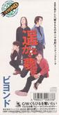

| 遥远的梦～Far away～ | 遥远的梦～Far away～ |
| --- | --- |
|  | |
| <ContentLink uid="wiki/beyond">Beyond</ContentLink>的歌曲 | <ContentLink uid="wiki/beyond">Beyond</ContentLink>的歌曲 |
| 发行日期 | 1993年6月25日 |
| 录制时间 | 1993年4月 |
| 类型 | 日本流行音乐 |
| 唱片公司 | Fun House（日语：BMG JAPAN） |
| 作曲 | <ContentLink uid="wiki/黃家駒">黄家驹</ContentLink> |
| 作词 | 森浩美 |
| <ContentLink uid="wiki/beyond">Beyond</ContentLink>单曲年表 | <ContentLink uid="wiki/beyond">Beyond</ContentLink>单曲年表 |

| リソ ラバ ～International～ （1992年） | **遥远的梦～Far away～**  （1993年） | Paradise （1994年） |
| --- | --- | --- |

《**遥远的梦～Far away～**》是香港摇滚乐队<ContentLink uid="wiki/beyond">Beyond</ContentLink>发行第三张日本单曲，是双主打单曲，收录两首歌曲是主打歌曲，《くちびるを夺いたい》是<ContentLink uid="wiki/黃家駒">黄家驹</ContentLink>和<ContentLink uid="wiki/黃家強">黄家强</ContentLink>最后一次合唱歌曲，《遥かなる梦に～Far away～》是《<ContentLink uid="wiki/海闊天空-beyond歌曲">海阔天空</ContentLink>》的日文版，亦是庆祝成军十周年的歌曲。

## 曲目

1.  遥かなる梦に～Far away～

## 外部链接

-   [YouTube上的遥かなる梦に～Far away～](https://www.youtube.com/watch?v=95kP8zmXpVs&t=0h0m0s)
