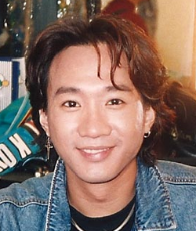

| 黄家驹 | 黄家驹 |
| --- | --- |
| 1992年的黄家驹 | |
| 男歌手 | 男歌手 |
| 罗马拼音 | Wong Ka Kui |
| 英文名 | Wong Ka Kui |
| 昵称 | 黄伯、家驹、二哥 |
| 别名 | Koma Wong |
| 国籍 | 英国属土公民 |
| 民族 | 汉族 |
| 籍贯 | 广东省台山市 |
| 出生 | 1962年6月10日 英属香港九龙深水埗苏屋邨 |
| 逝世 | 1993年6月30日（31岁） 日本东京都新宿区河田町东京女子医科大学医院[^1] |
| 死因 | 急性脑膜下血肿、头盖骨骨折、脑挫伤及急性脑肿胀[^2] |
| 墓地 | 香港将军澳华人永远坟场[^3] |
| 职业 | 创作歌手、吉他手 |
| 语言 | 粤语、台山话、英语、国语、日语 |
| 教育程度 | 中学五年级 |
| 母校 | 花地玛幼稚园 香港四邑商工总会新会商会学校 崇理英文书院 博允英文中学 |
| 亲属 | <ContentLink uid="wiki/黃家強">黄家强</ContentLink>（胞弟） |
| 音乐类型 | - 摇滚 - 华语流行 |
| 演奏乐器 | 人声、吉他 |
| 出道地点 | 香港 |
| 出道日期 | 1983年，​43年前 |
| 出道作品 | 大厦（1983年山叶吉他大赛冠军作品）- 脑部侵袭（1983年山叶吉他大赛冠军作品） - <ContentLink uid="wiki/再見理想">再见理想</ContentLink>（1986年自资录音带） |
| 代表作品 | **歌曲**：- <ContentLink uid="wiki/大地-beyond专辑">大地（1988）</ContentLink> - <ContentLink uid="wiki/命運派對">光辉岁月（1990）</ContentLink> - <ContentLink uid="wiki/海闊天空-beyond歌曲">海阔天空（1993）</ContentLink> |
| 活跃年代 | 1983年至1993年 |
| 唱片公司 | - Kinn's Music（1987年至1988年） - 新艺宝唱片（1988年至1992年） - 华纳唱片（1992年至1993年） |
| 经纪公司 | Kinn's Music（1987年至1992年） Amuse Inc.（1992年至1993年） |
| 相关团体 | <ContentLink uid="wiki/beyond">Beyond</ContentLink> |

| 奖项 |
| --- |
| 十大中文金曲颁奖音乐会 |
| **无休止符纪念奖** – 十大中文金曲  1993年   |
| 金曲奖 |
| **最佳歌词奖** – 十大劲歌金曲  1990年  **荣誉大奖** – 十大劲歌金曲  1993年   |
| 其他奖项 |
| **劲爆殿堂歌手** – 新城劲爆颁奖礼  2008年   |

**黄家驹**（英语：Wong Ka Kui；1962年6月10日—1993年6月30日），香港摇滚创作男歌手、吉他手，被认为是华语乐坛及摇滚乐的代表人物之一。[^4]为摇滚乐队<ContentLink uid="wiki/beyond">Beyond</ContentLink>的成员，在乐队中担任作曲、填词、节奏吉他手和主唱。黄家驹拥有独特的沙哑嗓音，对尾音的颤音式处理成为他的标志，他在短暂的一生中创作了数百首作品，其作品题材涉猎广泛，内容大多反映出香港当年社会的时弊以及自己的所见所感。[^5]

## 生活与事业

### 早年生活

1962年6月10日生于英属香港，祖籍广东台山。自小与家人居住在九龙深水埗区苏屋邨。曾就读香港四邑商工总会新会商会学校[^6][^注 1] 、崇理英文书院（塘尾道分校）及博允英文中学[^6][^注 2]。他在初中时受朋友影响而爱上欧美流行乐，偶像为大卫·宝儿，深紫乐队，Pink Floyd等。

年幼时，黄家驹和弟弟<ContentLink uid="wiki/黃家強">黄家强</ContentLink>非常任性和顽皮，家人不喜欢他们碰任何与音乐相关的东西。但他们就是喜欢音乐，所以家人只能放弃。

中五毕业后，曾任职办公室助理（粤语：辦公室助理）、铝窗、五金、空调、水电工程、电视台布景员、保险推销员等工作，曾经乐队鼓手<ContentLink uid="wiki/葉世榮">叶世荣</ContentLink>介绍，加入当时位于铜锣湾希慎道新宁大厦（现已重建为利园三期）的德高保险有限公司任职保险推销员[^7]，当时同事还有后来成为香港音乐人的梁翘柏。

### 圈中的朋友

除了Beyond的成员<ContentLink uid="wiki/葉世榮">叶世荣</ContentLink>、<ContentLink uid="wiki/黃貫中">黄贯中</ContentLink>外，黄家驹身为乐队的核心成员，多次获邀参与电子传媒的访问，因此在娱乐圈中结交了不少朋友，其中雷宇扬、单立文为他知心好友，身故后他们更是扶灵人。

此外，在新艺宝唱片时期在《交织千个心》的音乐录影带跟许冠杰合作，以及《天若有情》电影配乐时与罗大佑共事而结下良好交情。

黄家驹其他圈中的朋友还有包括同年代的一线歌手张国荣、谭咏麟、梅艳芳、林忆莲、陈慧娴、陈百强、林子祥、叶蒨文、刘美君、罗文外，而草蜢、太极乐队、郑秀文、刘德华、郭富城、张学友、黎明、刘以达、黄耀明、杜德伟、李克勤、邝美云、潘源良、陈少琪、王杰、黄翊、王菲、关淑怡、甄楚倩、温兆伦、吴婉芳、曾志伟、邓炜谦、李荣潮、周星驰、成龙、梁朝伟，音乐制作人陈少宝、黄柏高、何哲图，甚至曾当过儿童演员的唐宁、张继聪等，某程度上也跟他合作。

而在日本发展数年间，也跟爆风Slump（日语：爆風スランプ）鼓手Funky末吉（日语：ファンキー末吉），喜多郎，乐队圣饥魔II主唱小暮阁下等结成莫逆。

由于香港电台曾多次邀请Beyond参与公众活动（例如“太阳计划”），因此曾于港台任职的区瑞强、车淑梅、邓蔼霖、黄凯芹、黄霭君、余剑明、周影、周慧敏、阮兆祥、古巨基、许志安、张智霖，在某程度上也认识黄家驹。

### 参与成立Beyond

1981年，黄家驹经土瓜湾嘉林琴行老板介绍认识<ContentLink uid="wiki/葉世榮">叶世荣</ContentLink>，联同两位朋友邓炜谦及李荣潮组成乐队，这支乐队也是<ContentLink uid="wiki/beyond">Beyond</ContentLink>的雏型。1983年，为了参加《吉他杂志》举办的比赛，Beyond正式组成，Beyond这个名字是第一代主音吉他手邓炜谦所改，意思是“超越”自己，经过几次人事变动后，1984年，黄家驹的弟弟<ContentLink uid="wiki/黃家強">黄家强</ContentLink>加入成为低音吉他手；1985年，主音吉他手<ContentLink uid="wiki/黃貫中">黄贯中</ContentLink>加入。同年，Beyond在坚道的明爱中心自资举办《永远等待演唱会》，翌年再推出自资卡式带《<ContentLink uid="wiki/再見理想">再见理想</ContentLink>》，之后在经理人<ContentLink uid="wiki/陳健添">陈健添</ContentLink>（Leslie Chan）的协助下，从地下音乐正式进入商业流行乐坛。

经过多年努力，Beyond成为香港最重要乐队之一。1988年，终于凭专辑《<ContentLink uid="wiki/秘密警察-專輯">秘密警察</ContentLink>》内《大地》一曲夺得十大劲歌金曲，为乐队获得首个电子传媒奖项；1989年，由黄家驹作曲，小美填词，以感谢母亲为题的《真的爱你》夺得十大劲歌金曲及十大中文金曲两大奖项；1990年，Beyond歌曲《光辉岁月》由黄家驹作曲及填词，向当时刚出狱的南非黑人民权领袖曼德拉致敬；而除《光辉岁月》外，歌曲《俾面派对》（黄家驹作曲，<ContentLink uid="wiki/黃貫中">黄贯中</ContentLink>填词）两首歌分别夺得十大劲歌金曲奖及十大中文金曲奖，黄家驹亦凭《光辉岁月》夺得“最佳填词奖”。1991年，再凭《<ContentLink uid="wiki/amani">Amani</ContentLink>》获得十大中文金曲奖。

当时Beyond发表的作品大部分均由Beyond自己包办作曲、填词及演唱（但部分歌曲交由填词人填写，如<ContentLink uid="wiki/劉卓輝">刘卓辉</ContentLink>），除了经乐队发表作品，黄家驹偶尔也为其他歌手作曲，曾经合作的歌手包括：许冠杰、谭咏麟、王菲、麦洁文、彭健新等。后来，Beyond后期所属唱片公司（华纳）的高层抱着“好作品应留给自己，乐迷要听Beyond，就应买Beyond的唱片”的思想，反对Beyond把自己作品交给别人演唱。[^8]

黄家驹身为Beyond乐队的领袖，他的性格敢做敢言，不时发表大胆的言论，例如曾于93年《我哋呀Unplugged》音乐会之后说过：“**香港没有乐坛。**”批评当时香港娱乐圈过于重视歌手的人气而忽视了香港乐坛形式的发展，令香港乐坛没有一个真正独立、自主的空间，剥夺了音乐界人士的创作自由，因而令部分娱乐界人士不满。然而其果断、健谈的个性，也令他成为乐队的发言人及领导人，带领Beyond事业闯进多个高峰。

### 日本发展时期

1991年，Beyond于红磡香港体育馆举办五场《生命接触演唱会》，首次于红磡香港体育馆举行演唱会。由于对香港乐坛感到失望，加上希望乐队能在香港以外的地区发展，故在九十年代初期Beyond决定开拓东南亚、台湾、中国大陆、日本等亚洲市场。此时，日本经理人公司对Beyond感到兴趣，与他们签约，带同Beyond往日本发展。同年年尾，Beyond转投华纳唱片，开始Beyond的华纳时代。黄家驹表示，他们希望有更大自由度去玩音乐，以摆脱香港乐坛目前的限制。
1991年，由黄家驹演出，于1992年上映写实电影《<ContentLink uid="wiki/籠民">笼民</ContentLink>》，并担任男主角；该片在各个颁奖礼中屡获殊荣，包括第12届香港金像奖最佳影片奖。
1992年，Beyond开始长居日本，起初以为日本比香港有更大的自由度去玩音乐，惟仍要装“邻家男孩”去得到日本乐迷的关注。虽然他们在日本的生活孤独，但他们在那里认识不少的日本音乐风格，成了Beyond在日本发展最大的推动力。此时，Beyond在日本的知名度逐渐上升，同时亦吸纳到一群日本歌迷。

### 意外逝世

日本时间1993年6月24日凌晨1时，为宣传即将发行的日语单曲3吋细碟《<ContentLink uid="wiki/我想奪取妳的唇">我想夺取你的唇</ContentLink>》，Beyond应邀到富士电视台位于河田町的4号录影室拍摄游戏节目《小内小南的想做什么就做什么（日语：ウッチャンナンチャンのやるならやらねば!）》，游戏进行了15分钟便发生意外：黄家驹在狭窄并沾满水渍的台上奔跑时不慎滑倒，强大冲力使身旁3块布景板的固定装置脱落，布景板松开。黄家驹与身旁的主持人内村光良一同坠落2.7米的台下[^9]。黄家驹头部朝下摔落，后脑[^10]首先着地，随即昏迷；而内村光良由于头戴道具王冠且胸部首先着地，仅受轻伤。鉴于黄家驹头部严重受创，医师并未施手术清走脑内瘀血。

6月26日晚上，乐迷聚集香港商业电台停车场空地举行祝祷会，祈求黄家驹尽快康复。留医期间，Beyond的日本经理人公司邀请北京气功师辛勇赴日为他“发功”治疗[^11][^12]，同时开具处方中药给他服食，惟病况依然无起色[^注 3]。最终在留医六天后，于日本时间1993年6月30日下午4时15分在东京女子医科大学医院逝世，终年31岁。院方公布死因为急性脑膜下血肿、头盖骨骨折、脑挫伤及急性脑肿胀[^13]。《小内小南的想做什么就做什么》也应黄家驹的逝世而被富士电视台永久停播[^14]。

7月2日，黄家驹的遗体运回香港，7月4日于北角香港殡仪馆设灵。同日晚上香港商业电台于红磡鹤园及老龙坑高山剧场举行的“永远怀念家驹”悼念音乐会，全场坐满2600人，大部分与会者表现激动[^15]。翌日中午大殓，灵车驶出殡仪馆时，聚集在人行道上的数千名年轻乐迷冲出马路围着灵车[^16]，情况一度混乱。遗体最后下葬于将军澳华人永远坟场，近500名歌迷到场送别[^17]，而九龙塘省善真堂亦安放了其灵位。

## 影响

黄家驹的音乐作品，对香港、台湾、东南亚、中国大陆、日本及世界其他华人地区年轻乐迷仍然有着深远的影响。

Beyond其他三名成员以乐队名义推出多张专辑，即使乐队2005年宣布解散后，仍然继续创作音乐。

纵使黄家驹已逝世多年，但未被大众遗忘，直至现在每年他的生忌和死忌，仍然有大批来自世界各地的乐迷前往将军澳华人永远坟场拜祭，但墓碑曾四度被毁。2009年墓碑上的石吉他被人用黑笔涂污，金色碑文则遭涂黑，遗照更出现长裂痕，胞弟黄家强报警处理，翌年修葺完成时将黑白遗照换成另一张彩色照[^18]；2018年10月[^19]及2019年7月[^20]亦分别被涂污写上字句；2024年5月19日被一名自称“社会破坏者光头Bob”的15岁少年梁俊言（粤语：梁俊言）浇灌可乐、涂鸦、粗言辱骂兼铁锤砸毁遗照破坏，少年与另一名拍片的23岁男子叶子滔[^注 4]被当场拘捕[^21]，经调查后两人被控一项刑事损坏罪[^22]。7月16日，裁判官苏惠德于观塘裁判法院判处少年进入更生中心，另一被告则判入劳教中心。[^23]2024年5月底修葺完成时将彩色照换成另一张黑白遗照。

黄家驹所创作经典名曲《<ContentLink uid="wiki/海闊天空-beyond歌曲">海阔天空</ContentLink>》，于2022年4月12日，YouTube官方MV点击次数超过1亿人次，成为全球第一首YouTube点击次数突破1亿人次的广东（粤语）歌曲。

## 评价

### 香港

著名填词人<ContentLink uid="wiki/劉卓輝">刘卓辉</ContentLink>对黄家驹所发表“香港没有乐坛”一句留下深刻印象，认为这是黄家驹与别人不同之处。刘解释“懂得说这句说话的人并不多，即使懂得说或心里有同样想法的人，也没有胆量表达。黄家驹并非哗众取宠，而是在心里压抑一段很长时间，禁不住才说”。

### 台湾

有“华语流行乐教父”之称的台湾歌手罗大佑，亦曾在《是谁害死家驹！》这文章中写到 ：“那黄家驹为什么是在日本发生意外，而不是香港呢？原因是觉得在香港搞音乐没有什么前途，所以转往日本发展。”“不会再出一个黄家驹了，这样的人降临人世本来就是奇迹，上帝让黄家驹下凡，但是凡人没有珍惜他，反而谩骂他，诅咒他，结果，上帝把黄家驹收回了。上帝不会再派一个音乐天使下凡的。”

## 纪念

-   2005年11月8日，香港邮政推出《香港流行歌星》邮品系列中，黄家驹与陈百强、罗文、张国荣和梅艳芳分别成为获致敬推出邮票的五位已逝世歌手。[^24]
-   2008年，其弟兼Beyond低音吉他手<ContentLink uid="wiki/黃家強">黄家强</ContentLink>筹办了一连串纪念活动，香港电台及香港商业电台因应黄家驹去世15周年而制作纪念节目。
-   2010年，江门市星光公园于2010年落成，园内展示120多位江门籍文艺界明星群像，其中包括黄家驹的铜像。[^25][^26]
-   2016年6月10日，“家驹…爱心延续慈善演唱会2016”在湾仔香港会议展览中心举行。
-   2018年6月8日，黄家驹蜡像入驻北京杜莎夫人蜡像馆梦想音乐会，黄家强携家眷出席揭幕仪式。而北京杜莎夫人蜡像馆以黄家驹的蜡像作为“梦想音乐会”的首位入驻名人蜡像。[^27][^28][^29]
-   广州塔蜡像馆设有黄家驹蜡像。
-   2023年6月24日 ，电视广播有限公司纪念家驹告别乐坛30周年当日晚上10:30推出纪录片《永远光辉 黄家驹》。

## 坟墓被毁

黄家驹的墓碑历年来屡遭破坏，2024年已是第四次，过往于2009、2018、2019年都曾遭毁损[^30]。

2009年有自称Beyond Fans的人士通过邮件向香港媒体控诉，称<ContentLink uid="wiki/黃家強">黄家强</ContentLink>为个人名表时间不符而忽略当时已被破坏的家驹墓园，遭黄家强否认；家强方面称其个人曾对墓碑实施补救措施但无明显效果，并对破坏墓园人士发表谴责；同时香港媒体在播报中展示出已经受损的墓碑：金字油黑以及遗像裂痕加深。[^31]

2024年5月19日，黄家驹位于将军澳华人永远坟场的坟墓被15岁青年破坏[^32]，“光头Bob”将家驹墓碑用黑笔涂污、脚踢、淋泼汽水，坟墓的相片更被砸烂；期间更粗口辱骂和唱着海阔天空疑似博点击率[^33]，行为令人不齿。事后坟场管理员报警， 警方指一名15岁少年，及那名负责拍片的姓叶的23岁男子均涉嫌刑事毁坏被捕[^34][^35]，黄家驹友人兼黄家强助手刘先生闻讯后亦赶抵了解，他对事件感到愤怒，促警方和相关部门严肃看待[^36]而队友<ContentLink uid="wiki/黃貫中">黄贯中</ContentLink>、<ContentLink uid="wiki/葉世榮">叶世荣</ContentLink>及其胞弟黄家强均有发文谴责该事件。[^37]另外，黄家驹的生前好友单立文以及冯素波、马浚伟等艺人在其社交网站同样谴责事件，其中马浚伟在其社交网站要求政府及警方作出严厉惩处[^38]。最终两名涉事者被判入更生中心及劳教中心。[^39]

## 创作作品

主条目：<ContentLink uid="wiki/黃家駒音樂作品">黄家驹音乐作品</ContentLink>

## 专辑

主唱作品以<ContentLink uid="wiki/beyond">Beyond</ContentLink>名义推出。最后参与创作之作品，收录于粤语专辑《<ContentLink uid="wiki/樂與怒">乐与怒</ContentLink>》及国语专辑《<ContentLink uid="wiki/海闊天空-beyond專輯">海阔天空</ContentLink>》。

黄家驹去世后，Beyond所属的唱片公司——华纳唱片及滚石唱片先后推出致敬专辑。

## 电视剧

-   丽的电视《<ContentLink uid="wiki/浴血太平山">浴血太平山</ContentLink>》 饰 牧师（1981年）
-   香港电台《暴风少年》之“黑仔强” 饰 鬈毛（1987年）
-   香港电台《小说家族》对倒（1987年）

## 电影

-   《<ContentLink uid="wiki/肝膽相照">肝胆相照</ContentLink>》：配乐及客串（1987年3月）
-   《<ContentLink uid="wiki/靚妹正傳">靓妹正传</ContentLink>》：配乐及客串（1987年10月）
-   《黑色迷墙》：配乐及客串（1989年）
-   《<ContentLink uid="wiki/吉星拱照">吉星拱照</ContentLink>》 饰 游向东（1990年1月）
-   《<ContentLink uid="wiki/開心鬼救開心鬼">开心鬼救开心鬼</ContentLink>》 饰 文 （1990年6月）
-   《<ContentLink uid="wiki/beyond日記之莫欺少年窮">Beyond日记之莫欺少年穷</ContentLink>》 饰 吴驹（国语称"吴家驹"）（1991年4月）
-   《<ContentLink uid="wiki/豪門夜宴-1991年電影">豪门夜宴</ContentLink>》：配乐及客串（1991年11月）
-   《<ContentLink uid="wiki/籠民">笼民</ContentLink>》饰 毛仔（1992年11月）

## 主持

-   《够Hit斗玩Beyond加草蜢》（1989年10月）
-   《劲Band四斗士》（1990年10月）
-   《Beyond放暑假》（共12集）（1991年7月至9月）
-   《暑假玩到尽》（1992年）

## 个人奖项

更多信息：<ContentLink uid="wiki/beyond">Beyond</ContentLink>

-   电视广播有限公司“1990年度十大劲歌金曲 - 最佳填词奖”（得奖作品：《光辉岁月》）
-   新城电台“1992年度劲爆作曲人”（得奖作品：《长城》）
-   香港电台“第十六届十大中文金曲 - 无休止符纪念奖”（与另一位歌手陈百强分别于同一届获得追颁）
-   电视广播有限公司“1993年度十大劲歌金曲 - 荣誉大奖”（与另一位歌手陈百强分别于同一届获得追颁）
-   新城电台 新城劲爆家族音乐大赏作曲大赏：《长城》（1993年度）
-   香港商业电台“叱咤殿堂十大至尊作曲人”（1997年度）
-   新城电台“新城国语力殿堂音乐贡献大奖”（2008年度）
-   新城电台“新城劲爆殿堂歌手大奖”（2008年度）
-   亚洲偶像盛典荣获“终身成就奖”（2013年度）

## 荣誉

2018年杨光宇先生以黄家驹（Wongkakui）命名41742号小行星[^40]。

## 相关影视形象

-   2003年，2003年，2008年舞台剧《<ContentLink uid="wiki/駒歌">驹歌</ContentLink>》
-   2021年香港电影《<ContentLink uid="wiki/梅艷芳-電影">梅艳芳</ContentLink>》，由张进翘饰演黄家驹

## 参见

-   [Beyond Official Community beyond.com.hk](https://www.beyond.com.hk/)
-   [Beyond 音乐作品 beyond.com.hk](https://www.beyond.com.hk/音樂作品/)
-   <ContentLink uid="wiki/beyond">Beyond</ContentLink>
-   <ContentLink uid="wiki/黃家強">黄家强</ContentLink>
-   <ContentLink uid="wiki/黃貫中">黄贯中</ContentLink>
-   <ContentLink uid="wiki/葉世榮">叶世荣</ContentLink>
-   <ContentLink uid="wiki/劉志遠-香港音樂人">刘志远</ContentLink>
-   <ContentLink uid="wiki/四川衛視侮辱黃家駒事件">四川卫视侮辱黄家驹事件</ContentLink>

## 类似人物之事故

-   高以翔，2019年11月27日录制浙江卫视《追我吧》时意外身故。

## 注释

## 参考文献

## 外部链接

维基语录上的**黄家驹语录**

-   [黄家驹在香港影库上的简介](http://www.hkmdb.com/db/people/view.mhtml?id=8427&display_set=big5)
-   [黄家驹出殡片段](https://www.youtube.com/watch?v=pEMfIWzwCTw) （[页面存档备份](//web.archive.org/web/20210413174354/http://www.youtube.com/watch?v=pEMfIWzwCTw)，存于互联网档案馆） 香港无线电视《灵通天地线》（1993年7月）
-   [黄家驹逝世前一个月访问片段](https://m.youtube.com/watch?v=1S_tJUBJXUo&feature=youtu.be) 香港无线电视《娱乐新闻眼》（1993年5月）
-   [《海阔天空》](https://m.youtube.com/watch?v=V4GUy2EHMMs&feature=youtu.be) 黄家驹遗作（1993年5月）
-   [《真的爱你》](https://m.youtube.com/watch?v=n8aK_IUna_Y&feature=youtu.be) 黄家驹及Beyond成名作（1989年）
-   [Beyond Music](https://web.archive.org/web/20180227093230/http://www.beyondmusic.net/)
-   [【为Beyond干杯,为家驹干杯】-Beyond 珍贵音乐分享](https://www.youtube.com/user/tomohannw) （[页面存档备份](//web.archive.org/web/20170807185649/http://www.youtube.com/user/tomohannw)，存于互联网档案馆）
-   [我们的Beyond网](http://www.ourbeyond.com) （[页面存档备份](//web.archive.org/web/20210413174427/http://www.ourbeyond.com/)，存于互联网档案馆）
-   [黄家驹动态图片](https://web.archive.org/web/20120622195413/http://ilovebeyond.com/jiaju_pic.html)
-   [黄家驹中文网](http://www.2013beyond.com) （[页面存档备份](//web.archive.org/web/20210413174403/http://www.2013beyond.com/)，存于互联网档案馆）
-   [我们的永恒巨星特辑 - 黄家驹](https://web.archive.org/web/20100714212047/http://www.mingpaoweekly.com/eternalstars/wongkakui/index.php) 明报周刊
-   [《伞开以后》之 雨伞后](http://programme.rthk.hk/rthk/tv/programme.php?name=tv/umbrellamovement_1yron&d=2015-09-06&p=6959&e=317765&m=episode) （[页面存档备份](//web.archive.org/web/20160409090542/http://programme.rthk.hk/rthk/tv/programme.php?name=tv/umbrellamovement_1yron&d=2015-09-06&p=6959&e=317765&m=episode)，存于互联网档案馆）【音乐微电影简介】
-   [《伞开以后》之 雨伞后](https://www.youtube.com/watch?v=QNLMZ5MfTN0) （[页面存档备份](//web.archive.org/web/20211109051004/https://www.youtube.com/watch?v=QNLMZ5MfTN0)，存于互联网档案馆）【音乐微电影】（演出：李逸朗、戴萃瑶、谢志峰、梁安琪、倪秉郎）

[^7]: 资料出自Facebook公开群组“李郑屋村 (七层高世代)”于2017年7月16日发出的贴文以及有关的回应内容。贴文回应提及黄家驹与黄家强在大坑东的香港四邑商工总会新会商会学校读小学。

[^8]: 资料出自无线电视于1991年7月播出的综艺节目《BEYOND 放暑假》第3集。

[^15]: 早前致电联络嘉禾电影的邹文怀、蔡澜和成龙，希望能找到1985年成龙拍摄电影《龙兄虎弟》中受伤时帮成龙治疗脑部的两位南斯拉夫（今塞尔维亚）的世界级脑科医生，惟因当时发生南斯拉夫解体内战而无法前来日本协助治疗黄家驹的脑部。

[^24]: 两位为“白卡联盟”成员（即刘马车同行朋友）

[^1]: [當年今天：1993年6月30日 黃家駒拍遊戲節目意外死亡 ，究竟是意外還是陰謀？](https://hk.finance.yahoo.com/video/%E7%95%B6%E5%B9%B4%E4%BB%8A%E5%A4%A9-1993%E5%B9%B46%E6%9C%8830%E6%97%A5-%E9%BB%83%E5%AE%B6%E9%A7%92%E6%8B%8D%E9%81%8A%E6%88%B2%E7%AF%80%E7%9B%AE%E6%84%8F%E5%A4%96%E6%AD%BB%E4%BA%A1-%E7%A9%B6%E7%AB%9F%E6%98%AF%E6%84%8F%E5%A4%96%E9%82%84%E6%98%AF%E9%99%B0%E8%AC%80-032200091.html). 现代电视. 2023-06-25 [2023-10-03]. （原始内容[存档](https://web.archive.org/web/20231023144905/https://hk.finance.yahoo.com/video/%E7%95%B6%E5%B9%B4%E4%BB%8A%E5%A4%A9-1993%E5%B9%B46%E6%9C%8830%E6%97%A5-%E9%BB%83%E5%AE%B6%E9%A7%92%E6%8B%8D%E9%81%8A%E6%88%B2%E7%AF%80%E7%9B%AE%E6%84%8F%E5%A4%96%E6%AD%BB%E4%BA%A1-%E7%A9%B6%E7%AB%9F%E6%98%AF%E6%84%8F%E5%A4%96%E9%82%84%E6%98%AF%E9%99%B0%E8%AC%80-032200091.html)于2023-10-23）.

[^2]: [當年今天：1993年6月30日 黃家駒拍遊戲節目意外死亡 ，究竟是意外還是陰謀？](https://hk.finance.yahoo.com/video/%E7%95%B6%E5%B9%B4%E4%BB%8A%E5%A4%A9-1993%E5%B9%B46%E6%9C%8830%E6%97%A5-%E9%BB%83%E5%AE%B6%E9%A7%92%E6%8B%8D%E9%81%8A%E6%88%B2%E7%AF%80%E7%9B%AE%E6%84%8F%E5%A4%96%E6%AD%BB%E4%BA%A1-%E7%A9%B6%E7%AB%9F%E6%98%AF%E6%84%8F%E5%A4%96%E9%82%84%E6%98%AF%E9%99%B0%E8%AC%80-032200091.html). 现代电视. 2023-06-25 [2023-10-03]. （原始内容[存档](https://web.archive.org/web/20231023144905/https://hk.finance.yahoo.com/video/%E7%95%B6%E5%B9%B4%E4%BB%8A%E5%A4%A9-1993%E5%B9%B46%E6%9C%8830%E6%97%A5-%E9%BB%83%E5%AE%B6%E9%A7%92%E6%8B%8D%E9%81%8A%E6%88%B2%E7%AF%80%E7%9B%AE%E6%84%8F%E5%A4%96%E6%AD%BB%E4%BA%A1-%E7%A9%B6%E7%AB%9F%E6%98%AF%E6%84%8F%E5%A4%96%E9%82%84%E6%98%AF%E9%99%B0%E8%AC%80-032200091.html)于2023-10-23）.

[^3]: 15段6台25号

[^4]: [不死傳奇 2007/2008](https://web.archive.org/web/20211109050703/http://app1.rthk.org.hk/php/tvarchivecatalog/episode.php?progid=556&tvcat=2). （[原始内容](http://app1.rthk.org.hk/php/tvarchivecatalog/episode.php?progid=556&tvcat=2)存档于2021-11-09）.

[^5]: [黄家驹](http://www.mingpaoweekly.com/eternalstars/wongkakui/index.php) （[页面存档备份](//web.archive.org/web/20100714212047/http://www.mingpaoweekly.com/eternalstars/wongkakui/index.php)，存于互联网档案馆）特辑资料来源：《明报周刊》及《明日风尚》

[^6]: [Beyond 真的見証演唱會《心內心外》1988年自傳（隨碟附送小冊子版本）](https://archive.today/20220604011323/https://blog.xuite.net/lingsbeyond/twblog/111540216%23). Kinn's. 1999 [2022-06-04]. （[原始内容](https://blog.xuite.net/lingsbeyond/twblog/111540216%23)存档于2022-06-04）.

[^9]: [梁翹柏與黃家駒 (80年代初)](http://comebacktolove.blogspot.com/2015/11/80.html). [2020-11-27]. （原始内容[存档](https://web.archive.org/web/20210413174205/http://comebacktolove.blogspot.com/2015/11/80.html)于2021-04-13）.

[^10]: 邝国强、陈颂红，〈光辉岁月－黄家驹的最后专访〉，出自《壹周刊》174期特刊。1993年7月9日：第7页

[^11]: [黄家驹从2.7米高台上坠下 遗憾告别人世](http://bagua.ifensi.com/article-168306.html) 互联网档案馆的[存档](https://web.archive.org/web/20110713003446/http://bagua.ifensi.com/article-168306.html)，存档日期2011-07-13.

[^12]: “家驹遗体曾注射防腐剂”，文汇报第十五版，1993年7月6日

[^13]: [家驹出事新闻](https://www.youtube.com/watch?v=k14yKcNwu-0&feature=related) （[页面存档备份](//web.archive.org/web/20210413174234/http://www.youtube.com/watch?v=k14yKcNwu-0&feature=related)，存于互联网档案馆），亚洲电视及无线电视，1993年6月（第56秒开始讲述气功师医治家驹）

[^14]: “北京气功师应召赴日 为黄家驹发功驱瘀血 希望配合日本脑科医生施手术”，文汇报第二十八版，1993年6月27日

[^16]: [黄家驹逝世新闻发布会](https://www.youtube.com/watch?v=UuAlNZKeOV4) （[页面存档备份](//web.archive.org/web/20210413174241/http://www.youtube.com/watch?v=UuAlNZKeOV4)，存于互联网档案馆），富士电视台，1993年6月30日

[^17]: ウンナンの人気番組 事故で打ち切り決定 フジテレビ. 朝日新闻 (38602) 朝刊 (朝日新闻东京本社). 1993-07-21: 29.

[^18]: [黄家驹特辑（灵通天地线）](https://www.youtube.com/watch?v=rPYCDSDr_sc&feature=related) （[页面存档备份](//web.archive.org/web/20220907120108/https://www.youtube.com/watch?v=rPYCDSDr_sc&feature=related)，存于互联网档案馆），无线电视，1993年7月5日

[^19]: [新闻报道](https://www.youtube.com/watch?v=ZD5LOg3A3NY&feature=related) （[页面存档备份](//web.archive.org/web/20210413174259/http://www.youtube.com/watch?v=ZD5LOg3A3NY&feature=related)，存于互联网档案馆），亚洲电视及无线电视，1993年7月5日

[^20]: [灵通天地线](https://www.youtube.com/watch?v=XFRkFhrIlVs&feature=related) （[页面存档备份](//web.archive.org/web/20210413174252/http://www.youtube.com/watch?v=XFRkFhrIlVs&feature=related)，存于互联网档案馆），无线电视，1993年7月5日

[^21]: [陈百强墓碑也遭殃 黄家强叶世荣怒斥](https://yule.sohu.com/20090611/n264457232.shtml). 搜狐娱乐. [2025-02-11]. （原始内容[存档](https://web.archive.org/web/20260124030002/http://yule.sohu.com/20090611/n264457232.shtml)于2026-01-24）.

[^22]: 冼燕珊. [黃家駒墓碑遭人塗鴉 樂迷心碎自發清潔：用化學劑洗始終有損壞](https://www.hk01.com/%E7%9C%BE%E6%A8%82%E8%BF%B7/251902/%E9%BB%83%E5%AE%B6%E9%A7%92%E5%A2%93%E7%A2%91%E9%81%AD%E4%BA%BA%E5%A1%97%E9%B4%89-%E6%A8%82%E8%BF%B7%E5%BF%83%E7%A2%8E%E8%87%AA%E7%99%BC%E6%B8%85%E6%BD%94-%E7%94%A8%E5%8C%96%E5%AD%B8%E5%8A%91%E6%B4%97%E5%A7%8B%E7%B5%82%E6%9C%89%E6%90%8D%E5%A3%9E). 香港01. 2018-10-27 [2025-02-11]. （原始内容[存档](https://web.archive.org/web/20250219184156/https://www.hk01.com/%E7%9C%BE%E6%A8%82%E8%BF%B7/251902/%E9%BB%83%E5%AE%B6%E9%A7%92%E5%A2%93%E7%A2%91%E9%81%AD%E4%BA%BA%E5%A1%97%E9%B4%89-%E6%A8%82%E8%BF%B7%E5%BF%83%E7%A2%8E%E8%87%AA%E7%99%BC%E6%B8%85%E6%BD%94-%E7%94%A8%E5%8C%96%E5%AD%B8%E5%8A%91%E6%B4%97%E5%A7%8B%E7%B5%82%E6%9C%89%E6%90%8D%E5%A3%9E)于2025-02-19） （中文（香港））.

[^23]: [黃家駒墓碑又遭塗污破壞](https://hk.on.cc/hk/bkn/cnt/entertainment/20190709/bkn-20190709211023759-0709_00862_001.html). on.cc东网. 2019-07-09 [2025-02-11]. （原始内容[存档](https://web.archive.org/web/20250219184503/https://hk.on.cc/hk/bkn/cnt/entertainment/20190709/bkn-20190709211023759-0709_00862_001.html)于2025-02-19） （中文（香港））.

[^25]: [黃家駒墓碑屢遭塗污遺照現裂痕 黃家強報警處理未能成功阻嚇](https://std.stheadline.com/realtime/article/1999731/%E5%8D%B3%E6%99%82-%E5%A8%9B%E6%A8%82-%E5%AE%B6%E9%A7%92%E5%A2%93%E8%A2%AB%E6%AF%80%E4%B8%A8%E9%BB%83%E5%AE%B6%E9%A7%92%E5%A2%93%E7%A2%91%E5%B1%A2%E9%81%AD%E5%A1%97%E6%B1%A1%E9%81%BA%E7%85%A7%E7%8F%BE%E8%A3%82%E7%97%95-%E9%BB%83%E5%AE%B6%E5%BC%B7%E5%A0%B1%E8%AD%A6%E8%99%95%E7%90%86%E6%9C%AA%E8%83%BD%E6%88%90%E5%8A%9F%E9%98%BB%E5%9A%87). 星岛日报. 2024-05-19 [2024-05-21]. （原始内容[存档](https://web.archive.org/web/20241228055656/https://std.stheadline.com/realtime/article/1999731/%E5%8D%B3%E6%99%82-%E5%A8%9B%E6%A8%82-%E5%AE%B6%E9%A7%92%E5%A2%93%E8%A2%AB%E6%AF%80%E4%B8%A8%E9%BB%83%E5%AE%B6%E9%A7%92%E5%A2%93%E7%A2%91%E5%B1%A2%E9%81%AD%E5%A1%97%E6%B1%A1%E9%81%BA%E7%85%A7%E7%8F%BE%E8%A3%82%E7%97%95-%E9%BB%83%E5%AE%B6%E5%BC%B7%E5%A0%B1%E8%AD%A6%E8%99%95%E7%90%86%E6%9C%AA%E8%83%BD%E6%88%90%E5%8A%9F%E9%98%BB%E5%9A%87)于2024-12-28）.（繁体中文）

[^26]: [涉刑毀黃家駒墓碑 15歲少年保釋被拒 還押兒童及青少年院看管](https://hk.on.cc/hk/bkn/cnt/news/20240521/mobile/bkn-20240521123233234-0521_00822_001.html). on.cc东网. 2024-05-21 [2024-05-23]. （原始内容[存档](https://web.archive.org/web/20241228050948/https://hk.on.cc/hk/bkn/cnt/news/20240521/mobile/bkn-20240521123233234-0521_00822_001.html)于2024-12-28）.（繁体中文）

[^27]: [塗污破壞黃家駒墳墓有判決 兩被告分別判入更生中心及勞教中心](https://hk.on.cc/hk/bkn/cnt/entertainment/20240716/bkn-20240716122610903-0716_00862_001.html). on.cc东网. 2024-07-16 [2025-02-11]. （原始内容[存档](https://web.archive.org/web/20250219184315/https://hk.on.cc/hk/bkn/cnt/entertainment/20240716/bkn-20240716122610903-0716_00862_001.html)于2025-02-19） （中文（香港））.

[^28]: [發行「香港流行歌星」特別郵票](https://web.archive.org/web/20090310234835/http://www.hongkongpoststamps.com/chi/newsletter/2005/10/20051012a.htm). （[原始内容](http://www.hongkongpoststamps.com/chi/newsletter/2005/10/20051012a.htm)存档于2009-03-10）.

[^29]: [香港明星雕塑亮相江门(组图)-新闻频道](https://m.sohu.com/n/406647648/). 手机搜狐. 2014-12-04 [2019-09-09]. （原始内容[存档](https://web.archive.org/web/20210413174303/https://m.sohu.com/n/406647648/)于2021-04-13）.

[^30]: [香港明星雕塑亮相江门（组图）](http://finance.ifeng.com/a/20141204/13328432_0.shtml). 凤凰财经. 中国新闻网. 2014-12-04 [2019-09-09]. （原始内容[存档](https://web.archive.org/web/20210413180806/http://finance.ifeng.com/a/20141204/13328432_0.shtml)于2021-04-13）.

[^31]: [黄家驹入驻北京杜莎夫人蜡像馆 黄家强谈哥哥落泪](http://www.sohu.com/a/234769933_114941). 搜狐娱乐. 2018-06-09 [2019-09-09]. （原始内容[存档](https://web.archive.org/web/20210413174323/https://www.sohu.com/a/234769933_114941)于2021-04-13） （中文（中国大陆））.

[^32]: [黄家驹蜡像北京揭幕 黄家强动容追忆哥哥](https://web.archive.org/web/20201105053851/http://www.xinhuanet.com/ent/2018-06/11/c_1122967523.htm). 新华网. 2018-06-11 [2019-09-09]. （[原始内容](http://www.xinhuanet.com/ent/2018-06/11/c_1122967523.htm)存档于2020-11-05）.

[^33]: [泪目！黄家驹蜡像节目 弟弟现场重现《光辉岁月》](http://ent.ifeng.com/a/20180611/43056278_0.shtml). 凤凰网娱乐. 2018-06-11 [2019-09-09]. （原始内容[存档](https://web.archive.org/web/20210209100013/http://ent.ifeng.com/a/20180611/43056278_0.shtml)于2021-02-09）.

[^34]: 金秀玲. [黃家駒墓碑四度被毀 黃家強百字轟道德淪亡：賤種不滅，國亡不遠](https://www.hk01.com/%E5%8D%B3%E6%99%82%E5%A8%9B%E6%A8%82/1020962/%E9%BB%83%E5%AE%B6%E9%A7%92%E5%A2%93%E7%A2%91%E5%9B%9B%E5%BA%A6%E8%A2%AB%E6%AF%80-%E9%BB%83%E5%AE%B6%E5%BC%B7%E7%99%BE%E5%AD%97%E8%BD%9F%E9%81%93%E5%BE%B7%E6%B7%AA%E4%BA%A1-%E8%B3%A4%E7%A8%AE%E4%B8%8D%E6%BB%85-%E5%9C%8B%E4%BA%A1%E4%B8%8D%E9%81%A0). 香港01. 2024-05-19 [2025-08-21]. （原始内容[存档](https://web.archive.org/web/20260519192454/https://www.hk01.com/%E5%8D%B3%E6%99%82%E5%A8%9B%E6%A8%82/1020962/%E9%BB%83%E5%AE%B6%E9%A7%92%E5%A2%93%E7%A2%91%E5%9B%9B%E5%BA%A6%E8%A2%AB%E6%AF%80-%E9%BB%83%E5%AE%B6%E5%BC%B7%E7%99%BE%E5%AD%97%E8%BD%9F%E9%81%93%E5%BE%B7%E6%B7%AA%E4%BA%A1-%E8%B3%A4%E7%A8%AE%E4%B8%8D%E6%BB%85-%E5%9C%8B%E4%BA%A1%E4%B8%8D%E9%81%A0)于2026-05-19） （中文（香港））.

[^35]: miligowu. [6/5報導：家駒墓碑被破壞](https://www.youtube.com/watch?v=MKetgfk625s). 2009-06-05 [2026-05-31] –通过YouTube.

[^36]: [Beyond黃家駒墓被毀｜光頭Bob屢次針對家駒墓 去年爆汗罵墳：海闊天空好難聽](https://www.stheadline.com/breaking-news/3345946/Beyond%E9%BB%83%E5%AE%B6%E9%A7%92%E5%A2%93%E8%A2%AB%E6%AF%80%E5%85%89%E9%A0%ADBob%E5%B1%A2%E6%AC%A1%E9%87%9D%E5%B0%8D%E5%AE%B6%E9%A7%92%E5%A2%93-%E5%8E%BB%E5%B9%B4%E7%88%86%E6%B1%97%E7%BD%B5%E5%A2%B3%E6%B5%B7%E9%97%8A%E5%A4%A9%E7%A9%BA%E5%A5%BD%E9%9B%A3%E8%81%BD). 星岛头条. 2024-05-19 [2025-08-21]. （原始内容[存档](https://web.archive.org/web/20260313074317/https://www.stheadline.com/breaking-news/3345946/Beyond%E9%BB%83%E5%AE%B6%E9%A7%92%E5%A2%93%E8%A2%AB%E6%AF%80%E5%85%89%E9%A0%ADBob%E5%B1%A2%E6%AC%A1%E9%87%9D%E5%B0%8D%E5%AE%B6%E9%A7%92%E5%A2%93-%E5%8E%BB%E5%B9%B4%E7%88%86%E6%B1%97%E7%BD%B5%E5%A2%B3%E6%B5%B7%E9%97%8A%E5%A4%A9%E7%A9%BA%E5%A5%BD%E9%9B%A3%E8%81%BD)于2026-03-13） （中文（香港））.

[^37]: [黃家駒墓碑遭破壞 警拘兩人 汽水潑鐵槌砸 拍片上載疑博點擊率 - 20240520 - 港聞](https://news.mingpao.com/pns/%E6%B8%AF%E8%81%9E/article/20240520/s00002/1716144358903/%E9%BB%83%E5%AE%B6%E9%A7%92%E5%A2%93%E7%A2%91%E9%81%AD%E7%A0%B4%E5%A3%9E-%E8%AD%A6%E6%8B%98%E5%85%A9%E4%BA%BA-%E6%B1%BD%E6%B0%B4%E6%BD%91%E9%90%B5%E6%A7%8C%E7%A0%B8-%E6%8B%8D%E7%89%87%E4%B8%8A%E8%BC%89%E7%96%91%E5%8D%9A%E9%BB%9E%E6%93%8A%E7%8E%87). 明报新闻网 - 每日明报 daily news. [2025-08-21]. （原始内容[存档](https://web.archive.org/web/20250327171510/https://news.mingpao.com/pns/%E6%B8%AF%E8%81%9E/article/20240520/s00002/1716144358903/%E9%BB%83%E5%AE%B6%E9%A7%92%E5%A2%93%E7%A2%91%E9%81%AD%E7%A0%B4%E5%A3%9E-%E8%AD%A6%E6%8B%98%E5%85%A9%E4%BA%BA-%E6%B1%BD%E6%B0%B4%E6%BD%91%E9%90%B5%E6%A7%8C%E7%A0%B8-%E6%8B%8D%E7%89%87%E4%B8%8A%E8%BC%89%E7%96%91%E5%8D%9A%E9%BB%9E%E6%93%8A%E7%8E%87)于2025-03-27） （中文（繁体））.

[^38]: 朱棨新. [黃家駒墓被毀案 官斥行為可恥 判兩少年分別入更生及勞教中心](https://www.hk01.com/%E7%A4%BE%E6%9C%83%E6%96%B0%E8%81%9E/1038528/%E9%BB%83%E5%AE%B6%E9%A7%92%E5%A2%93%E8%A2%AB%E6%AF%80%E6%A1%88-%E5%AE%98%E6%96%A5%E8%A1%8C%E7%82%BA%E5%8F%AF%E6%81%A5-%E5%88%A4%E5%85%A9%E5%B0%91%E5%B9%B4%E5%88%86%E5%88%A5%E5%85%A5%E6%9B%B4%E7%94%9F%E5%8F%8A%E5%8B%9E%E6%95%99%E4%B8%AD%E5%BF%83). 香港01. 2024-07-16 [2025-08-21]. （原始内容[存档](https://web.archive.org/web/20260213020644/https://www.hk01.com/%E7%A4%BE%E6%9C%83%E6%96%B0%E8%81%9E/1038528/%E9%BB%83%E5%AE%B6%E9%A7%92%E5%A2%93%E8%A2%AB%E6%AF%80%E6%A1%88-%E5%AE%98%E6%96%A5%E8%A1%8C%E7%82%BA%E5%8F%AF%E6%81%A5-%E5%88%A4%E5%85%A9%E5%B0%91%E5%B9%B4%E5%88%86%E5%88%A5%E5%85%A5%E6%9B%B4%E7%94%9F%E5%8F%8A%E5%8B%9E%E6%95%99%E4%B8%AD%E5%BF%83)于2026-02-13） （中文（香港））.

[^39]: [Beyond黃家駒墓被毀｜KOL光頭Bob涉案被捕 曾自稱患有自閉症及過度活躍症](https://www.stheadline.com/breaking-news/3345912/Beyond%E9%BB%83%E5%AE%B6%E9%A7%92%E5%A2%93%E8%A2%AB%E6%AF%80KOL%E5%85%89%E9%A0%ADBob%E6%B6%89%E6%A1%88%E8%A2%AB%E6%8D%95-%E6%9B%BE%E8%87%AA%E7%A8%B1%E6%82%A3%E6%9C%89%E8%87%AA%E9%96%89%E7%97%87%E5%8F%8A%E9%81%8E%E5%BA%A6%E6%B4%BB%E8%BA%8D%E7%97%87). 星岛头条. 2024-05-19 [2025-08-21]. （原始内容[存档](https://web.archive.org/web/20260305174404/https://www.stheadline.com/breaking-news/3345912/Beyond%E9%BB%83%E5%AE%B6%E9%A7%92%E5%A2%93%E8%A2%AB%E6%AF%80KOL%E5%85%89%E9%A0%ADBob%E6%B6%89%E6%A1%88%E8%A2%AB%E6%8D%95-%E6%9B%BE%E8%87%AA%E7%A8%B1%E6%82%A3%E6%9C%89%E8%87%AA%E9%96%89%E7%97%87%E5%8F%8A%E9%81%8E%E5%BA%A6%E6%B4%BB%E8%BA%8D%E7%97%87)于2026-03-05） （中文（香港））.

[^40]: 郑嘉惠, 马耀文. [黃家駒墳墓刑毀｜白布蓋墓碑 四川女歌迷跪地泣不成聲：太心痛了](https://www.hk01.com/%E7%AA%81%E7%99%BC/1020918/%E9%BB%83%E5%AE%B6%E9%A7%92%E5%A2%B3%E5%A2%93%E5%88%91%E6%AF%80-%E7%99%BD%E5%B8%83%E8%93%8B%E5%A2%93%E7%A2%91-%E5%9B%9B%E5%B7%9D%E5%A5%B3%E6%AD%8C%E8%BF%B7%E8%B7%AA%E5%9C%B0%E6%B3%A3%E4%B8%8D%E6%88%90%E8%81%B2-%E5%A4%AA%E5%BF%83%E7%97%9B%E4%BA%86). 香港01. 2024-05-19 [2025-08-21]. （原始内容[存档](https://web.archive.org/web/20240530201942/https://www.hk01.com/%E7%AA%81%E7%99%BC/1020918/%E9%BB%83%E5%AE%B6%E9%A7%92%E5%A2%B3%E5%A2%93%E5%88%91%E6%AF%80-%E7%99%BD%E5%B8%83%E8%93%8B%E5%A2%93%E7%A2%91-%E5%9B%9B%E5%B7%9D%E5%A5%B3%E6%AD%8C%E8%BF%B7%E8%B7%AA%E5%9C%B0%E6%B3%A3%E4%B8%8D%E6%88%90%E8%81%B2-%E5%A4%AA%E5%BF%83%E7%97%9B%E4%BA%86)于2024-05-30） （中文（香港））.

[^41]: 邓颖琪. [黃家駒墓碑被淋汽水、用鐵鎚瘋狂破壞 葉世榮：家駒不會放過他們](https://www.hk01.com/%E5%8D%B3%E6%99%82%E5%A8%9B%E6%A8%82/1020907/%E9%BB%83%E5%AE%B6%E9%A7%92%E5%A2%93%E7%A2%91%E8%A2%AB%E6%B7%8B%E6%B1%BD%E6%B0%B4-%E7%94%A8%E9%90%B5%E9%8E%9A%E7%98%8B%E7%8B%82%E7%A0%B4%E5%A3%9E-%E8%91%89%E4%B8%96%E6%A6%AE-%E5%AE%B6%E9%A7%92%E4%B8%8D%E6%9C%83%E6%94%BE%E9%81%8E%E4%BB%96%E5%80%91). 香港01. 2024-05-19 [2025-08-21]. （原始内容[存档](https://web.archive.org/web/20250518011549/https://www.hk01.com/%E5%8D%B3%E6%99%82%E5%A8%9B%E6%A8%82/1020907/%E9%BB%83%E5%AE%B6%E9%A7%92%E5%A2%93%E7%A2%91%E8%A2%AB%E6%B7%8B%E6%B1%BD%E6%B0%B4-%E7%94%A8%E9%90%B5%E9%8E%9A%E7%98%8B%E7%8B%82%E7%A0%B4%E5%A3%9E-%E8%91%89%E4%B8%96%E6%A6%AE-%E5%AE%B6%E9%A7%92%E4%B8%8D%E6%9C%83%E6%94%BE%E9%81%8E%E4%BB%96%E5%80%91)于2025-05-18） （中文（香港））.

[^42]: [家駒墓碑遭破壞 馬浚偉強烈要求政府及警方作出嚴厲懲處](https://www.tkww.hk/a/202405/19/AP6649f4c7e4b0e3971d753363.html). 大公文汇网. [2025-08-21]. （原始内容[存档](https://web.archive.org/web/20240525050605/https://www.tkww.hk/a/202405/19/AP6649f4c7e4b0e3971d753363.html)于2024-05-25） （zh-Hans-HK）.

[^43]: [博掌聲塗污破壞黃家駒墳墓 兩被告分別判入更生中心及勞教中心](https://hk.news.yahoo.com/%E5%8D%9A%E6%8E%8C%E8%81%B2%E5%A1%97%E6%B1%A1%E7%A0%B4%E5%A3%9E%E9%BB%83%E5%AE%B6%E9%A7%92%E5%A2%B3%E5%A2%93-%E5%85%A9%E8%A2%AB%E5%91%8A%E5%88%86%E5%88%A5%E5%88%A4%E5%85%A5%E6%9B%B4%E7%94%9F%E4%B8%AD%E5%BF%83%E5%8F%8A%E5%8B%9E%E6%95%99%E4%B8%AD%E5%BF%83-031815418.html). Yahoo News. 2024-07-16 [2025-08-21]. （原始内容[存档](https://web.archive.org/web/20240807022033/https://hk.news.yahoo.com/%E5%8D%9A%E6%8E%8C%E8%81%B2%E5%A1%97%E6%B1%A1%E7%A0%B4%E5%A3%9E%E9%BB%83%E5%AE%B6%E9%A7%92%E5%A2%B3%E5%A2%93-%E5%85%A9%E8%A2%AB%E5%91%8A%E5%88%86%E5%88%A5%E5%88%A4%E5%85%A5%E6%9B%B4%E7%94%9F%E4%B8%AD%E5%BF%83%E5%8F%8A%E5%8B%9E%E6%95%99%E4%B8%AD%E5%BF%83-031815418.html)于2024-08-07） （中文（香港））.

[^44]: 香港天文学会智能手机应用程序《香港天文》2018年5月31日新闻报导
