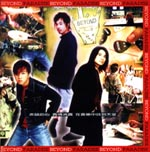

| Paradise | Paradise |
| --- | --- |
|  | |
| <ContentLink uid="wiki/beyond">Beyond</ContentLink>的錄音室專輯 | <ContentLink uid="wiki/beyond">Beyond</ContentLink>的錄音室專輯 |
| 發行日期 | 1994年7月13日，​32年前 |
| 類型 | 華語流行音樂 |
| 唱片公司 | 滾石唱片 |
| <ContentLink uid="wiki/beyond">Beyond</ContentLink>專輯年表 | <ContentLink uid="wiki/beyond">Beyond</ContentLink>專輯年表 |

| <ContentLink uid="wiki/海闊天空-beyond專輯">海闊天空</ContentLink> （1993年） | **Paradise** （1994年） | <ContentLink uid="wiki/愛與生活">愛與生活</ContentLink> （1995年） |
| --- | --- | --- |

《**Paradise**》是香港搖滾樂隊<ContentLink uid="wiki/beyond">Beyond</ContentLink>發行的第五張國語專輯，《Paradise》是<ContentLink uid="wiki/beyond">Beyond</ContentLink>樂隊在主音<ContentLink uid="wiki/黃家駒">黃家駒</ContentLink>逝世後，三人復出發行的首張專輯，Beyond在台灣舉辦《一輩子陪我走音樂會》是黃家駒離世後，首度在台灣公開演出，受到極大的矚目。
這唱片充滿著懷念黃家駒的感覺，其中《Paradise》、《祝您愉快》、《We Don't Wanna Make It Without You》 都是懷念黃家駒之作。而《一輩子陪我走》則是以一個輕快的伴奏，高歌四子手足之情。

## 曲目

| 次序 | 歌名 | 填詞 | 作曲 | 主唱 |
| --- | --- | --- | --- | --- |
| 1. | Paradise | 黃貫中 | 黃貫中 | 黃貫中 |
| 2. | 一輩子陪我走 (Accompany Me For A Lifetime) | 黃家強 | 黃家強 | Beyond |
| 3. | 無名英雄 (The Unknown Hero) | 鄭智化 | 黃家強/黃貫中 | 黃家強 |
| 4. | 情深依舊 (Still There Is Love) | 姚若龍 | 黃貫中 | 黃貫中 |
| 5. | 溫柔殺手 (The Tender Killer) | 厲曼婷 | 黃家強 | 黃家強 |
| 6. | 和平世界 (The Peaceful World) | Michael | 黃家強 | 黃家強 |
| 7. | 因為有你有我 (Because There Are You And Me) | 厲曼婷 | 黃家強 | 黃家強 |
| 8. | 對嗎 (Is It Right?) | 廖瑩如 | 黃家強/黃貫中/葉世榮 | 黃家強 |
| 9. | Dancing In The Rain | 廖瑩如 | 黃貫中 | 黃貫中 |
| 10. | We Don't Wanna Make It Without You | 黃貫中 | 黃貫中 | Beyond |
| 11. | 祝您愉快 (Wishinging You Happiness) | 黃家強 | 黃家強 | 黃家強 |
| 12. | Paradise（演奏版） (Instrumental) | - | - | - |
