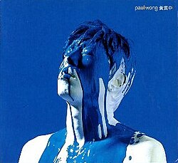

| Yellow Paul Wong | Yellow Paul Wong |
| --- | --- |
|  | |
| <ContentLink uid="wiki/黃貫中">黃貫中</ContentLink>的錄音室專輯 | <ContentLink uid="wiki/黃貫中">黃貫中</ContentLink>的錄音室專輯 |
| 發行日期 | 2001年1月10日 |
| 錄製時間 | 2000年  Polar Bear Studio  (Hong Kong) <ContentLink uid="wiki/二樓後座">二樓後座</ContentLink>  (Hong Kong) Folio Sound  (Japan) |
| 類型 | 搖滾、粵語流行音樂 |
| 時長 | 51:10 |
| 唱片公司 | 環球唱片 |
| 製作人 | <ContentLink uid="wiki/黃貫中">黃貫中</ContentLink> |
| <ContentLink uid="wiki/黃貫中">黃貫中</ContentLink>專輯年表 | <ContentLink uid="wiki/黃貫中">黃貫中</ContentLink>專輯年表 |

| | **Yellow Paul Wong** （2001年） | 黑白 （2001年） |
| --- | --- | --- |

《**Yellow Paul Wong**》是香港歌手<ContentLink uid="wiki/黃貫中">黃貫中</ContentLink>發行第一張粵語專輯。於2001年1月10日發行。

## 背景

當<ContentLink uid="wiki/beyond">Beyond</ContentLink>在1999年宣布三位成員投入各自的個人發展，黃貫中便是三人之中最先發表個人專輯的成員。 唱片裡除了新組成的樂隊汗之外，亦邀講了LMF、張亞東、Mick Karn、Sugizo、Funky未吉覺等中外樂人參與製作.

## 製作過程

黃貫中在訪問中透露專輯的創作過程基本上和過往沒有多大分別，仍然是以木吉他創作旋律，伴奏樂隊也會給於意見，當大部份的歌曲皆完成後，黃貫中作出了新的嘗試，就是先帶同新樂隊汗在馬來西亞進行演出，將所有將要收錄在新專輯的歌曲皆表演過，才返回錄音室灌錄。整張專輯的主要灌錄工程皆在新設立的Polar Bear Studio進行，另外還特別遠赴英國的Abbey Road Studio進行Mastering製作。

## 曲目

| 次序 | 歌名 | 作曲 | 填詞 | 編曲 | 監製 |
| --- | --- | --- | --- | --- | --- |
| 1. | 無得比 | 黃貫中 | <ContentLink uid="wiki/劉卓輝">劉卓輝</ContentLink> | 黃貫中 | 黃貫中 |
| 2. | 丟架 | 黃貫中 | 黃貫中 | 黃貫中 | 黃貫中 |
| 3. | 某日 | 黃貫中 | 黃貫中 | 黃貫中 | 黃貫中 |
| 4. | 睡火山 | 黃貫中 | 黃貫中 | 黃貫中 | 黃貫中 |
| 5. | 乜Q報章 | 黃貫中 | 黃貫中 | 黃貫中 | 黃貫中 |
| 6. | 香港一定得 | 黃貫中 | MC仁/陳偉雄/梁永傑/孫國華/麥文威 | 黃貫中 | 黃貫中 |
| 7. | 沒有 | 黃貫中 | 黃貫中 | 黃貫中 | 黃貫中 |
| 8. | 有路 | 黃貫中 | 劉卓輝 | 黃貫中 | 黃貫中 |
| 9. | 貫中的動物園(instrumental) | 黃貫中 | - | 黃貫中 | 黃貫中 |
| 10. | 香港晚安 | 黃貫中 | 劉卓輝 | 張亞東 | 黃貫中 |
| 11. | 廢墟 | 黃貫中 | 劉卓輝 | 黃貫中 | 黃貫中 |

參考資料
