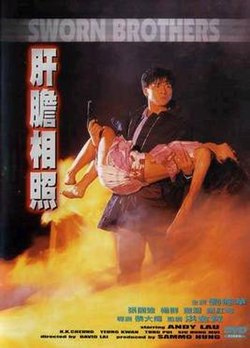

| 肝膽相照   *Sworn Brothers* | 肝膽相照   *Sworn Brothers* |
| --- | --- |
|  | |
| 基本資料 | 基本資料 |
| 導演 | 黎大煒 |
| 監製 | 洪金寶 |
| 製片 | 陳佩華、黃小瓊 |
| 編劇 | 黎大煒 文雋 |
| 主演 | 劉德華 張國強 楊群 蕭紅梅 王玉環 |
| 配樂 | 鮑比達、周錦祥 |
| 攝影 | 林輝泰 林國華 |
| 剪輯 | 張耀宗 |
| 製片商 | 嘉禾(香港)有限公司 |
| 片長 | 91 分鐘 |
| 產地 | 英屬香港 |
| 語言 | 粵語 |
| 上映及發行 | 上映及發行 |
| 上映日期 | 英屬香港：- 1987年3月12日 |
| 發行商 | 嘉禾(香港)有限公司 |
| 票房 | HK$ 8,480,443.00 |

《**肝膽相照**》（英語：*Sworn Brothers*）是1987年上映的一部香港動作劇情片，由黎大煒執導，劉德華、張國強、楊群和蕭紅梅主演。

## 劇情簡介

豹叔收養了朋友的兒子阿定（劉德華飾），與自己兒子阿國（張國強飾）情同手足。兩人長大後，阿國成為從蘇格蘭場學成的警官，阿定成為犯罪集團的殺手楊東海（楊群飾）的得力助手。阿定駕車往機場，迎接返港的警官阿國。

楊東海實為黑社會頭子，販賣軍火，走私毒品。阿定在黑社會上發跡，但阿定盜亦有道，拒絕沾手毒品。阿國報到後，即奉命緝破楊東海的犯罪集團。阿定船上遇雯雯（蕭紅梅飾），一見傾心，並贏得芳心。阿國勸阿定改邪歸正，阿定也有悔意。

楊東海知道阿定想離開他之後，不想放過他，欲使其成為黑吃黑的犧牲品。楊東海欲找阿定替其處理毒品生意，故意買人刺傷自己，要求阿定替其出面談判，阿定答允，不料談判破裂。

## 角色

| **演員** | **角色** | **粵語配音** | **簡介** |
| --- | --- | --- | --- |
| 劉德華 | 林定一 | 李學斌 | |
| 張國強 | 阿國 | 黃志成 | |
| 楊群 | 楊東海 | 楊群 | |
| 蕭紅梅 | 雯雯 | 沈小蘭 | 化妝品店員，想成為歌星 |
| 董驃 | 豹叔 | 董驃 | 阿國父親，警察 |
| 錢嘉樂 | 嘉樂 | | |
| 王玉環 | | | 楊東海的女兒 |
| 黎大煒 | | | 港聞記者（客串）[^1] |

## 影片分級

電視

| 國家／地區 | 分級 |
| --- | --- |
| 香港 | PG(成人情節、不雅用語及暴力) |

## 外部連結

-   香港影庫上《[肝膽相照](https://hkmdb.com/db/movies/view.mhtml?id=6894&display_set=big5)》的資料（繁體中文）
-   開眼電影網上《[肝膽相照](http://app2.atmovies.com.tw/film/fshk40093071)》的資料（繁體中文）
-   時光網上《[肝膽相照](http://movie.mtime.com/22884/)》的資料（簡體中文）
-   豆瓣電影上《[肝膽相照](https://movie.douban.com/subject/1295522/)》的資料 （簡體中文）
-   爛番茄上《[肝膽相照](https://www.rottentomatoes.com/m/sworn_brother)》的資料（英文）
-   AllMovie上《[肝膽相照](https://www.allmovie.com/movie/v140750)》的資料（英文）
-   網際網路電影資料庫（IMDb）上《[肝膽相照](https://www.imdb.com/title/tt0093071/)》的資料（英文）

參考資料

[^1]: [黎大煒出入台海關 常免受檢內有原因](https://web.archive.org/web/20220224134434/https://mmis.hkpl.gov.hk/coverpage/-/coverpage/view?_coverpage_WAR_mmisportalportlet_hsf=%E9%BB%8E%E5%A4%A7%E7%85%92&p_r_p_-1078056564_c=QF757YsWv5%2BakvA8rFW5EqqlqspnV0%2F6&_coverpage_WAR_mmisportalportlet_o=73&_coverpage_WAR_mmisportalportlet_actual_q=%28%20verbatim_dc.collection%3A%28%22Old%5C%20HK%5C%20Newspapers%22%29%20%29%20AND+%28%20%28%20allTermsMandatory%3A%28true%29%20OR+all_dc.title%3A%28%E9%BB%8E%E5%A4%A7%E7%85%92%29%20OR+all_dc.creator%3A%28%E9%BB%8E%E5%A4%A7%E7%85%92%29%20OR+all_dc.contributor%3A%28%E9%BB%8E%E5%A4%A7%E7%85%92%29%20OR+all_dc.subject%3A%28%E9%BB%8E%E5%A4%A7%E7%85%92%29%20OR+fulltext%3A%28%E9%BB%8E%E5%A4%A7%E7%85%92%29%20OR+all_dc.description%3A%28%E9%BB%8E%E5%A4%A7%E7%85%92%29%20%29%20%29&_coverpage_WAR_mmisportalportlet_sort_order=desc&_coverpage_WAR_mmisportalportlet_sort_field=score). 華僑日報. 1987-03-10: 25 [2022-02-24]. （[原始內容](https://mmis.hkpl.gov.hk/coverpage/-/coverpage/view?_coverpage_WAR_mmisportalportlet_hsf=%E9%BB%8E%E5%A4%A7%E7%85%92&p_r_p_-1078056564_c=QF757YsWv5%2BakvA8rFW5EqqlqspnV0%2F6&_coverpage_WAR_mmisportalportlet_o=73&_coverpage_WAR_mmisportalportlet_actual_q=%28%20verbatim_dc.collection%3A%28%22Old%5C%20HK%5C%20Newspapers%22%29%20%29%20AND+%28%20%28%20allTermsMandatory%3A%28true%29%20OR+all_dc.title%3A%28%E9%BB%8E%E5%A4%A7%E7%85%92%29%20OR+all_dc.creator%3A%28%E9%BB%8E%E5%A4%A7%E7%85%92%29%20OR+all_dc.contributor%3A%28%E9%BB%8E%E5%A4%A7%E7%85%92%29%20OR+all_dc.subject%3A%28%E9%BB%8E%E5%A4%A7%E7%85%92%29%20OR+fulltext%3A%28%E9%BB%8E%E5%A4%A7%E7%85%92%29%20OR+all_dc.description%3A%28%E9%BB%8E%E5%A4%A7%E7%85%92%29%20%29%20%29&_coverpage_WAR_mmisportalportlet_sort_field=score&_coverpage_WAR_mmisportalportlet_sort_order=desc)存檔於2022-02-24）.
