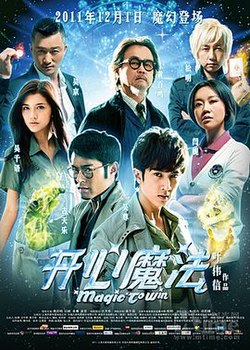

| 開心魔法   *Magic to Win* | 開心魔法   *Magic to Win* |
| --- | --- |
|  | |
| 基本資料 | 基本資料 |
| 導演 | 葉偉信 |
| 監製 | 黃百鳴 |
| 編劇 | 黃子桓 |
| 主演 | 黃百鳴 吳尊 吳千語 吳京 閆妮 |
| 配樂 | 趙增熹 張人傑 |
| 主題曲 | 〈戀愛咒語〉 〈開心魔法〉 |
| 攝影 | 張文寶 (HKSC) |
| 剪輯 | 張嘉輝 (HKSE) |
| 製片商 | 天娛傳媒 華誼兄弟 天馬電影出品 (香港) 有限公司 |
| 片長 | 100 分鐘 |
| 產地 | 中國    香港 |
| 語言 | 粵語、國語 |
| 上映及發行 | 上映及發行 |
| 上映日期 | ：- 2011年12月1日 ：- 2011年12月8日 ：- 2011年12月9日 ：- 2011年12月16日 ：2012年1月13日 |
| 發行商 | 天馬電影發行有限公司 |
| 前作與續作 | 前作與續作 |
| 前作 | 開心鬼上錯身 |

-   電影主題

**《開心魔法》**（英語：*Magic to Win*）是中國大陸與香港合拍的魔幻喜劇電影作品，名義上是《開心鬼》電影系列的第六集，保留了原主角康森貴角色，同時從中學老師榮升為大學教授，題材因應中國大陸電影審查改以魔法。由葉偉信導演，黃百鳴監製兼領銜主演，吳尊、吳京及閆妮領銜主演，吳千語特別介紹，定於2011年12月1日於中國全國公映，領銜賀歲檔，目前已經售出英、美、加、澳、韓等10多個國家和地區的院線發行權[^1]。

## 劇情大綱

宇宙之大，無奇不有，有很多不可思議的事情是無法解釋。康森貴 (黃百鳴飾演)除了是一名大學教授，更是五行魔法的「水」系魔法師，卻無人知道他擁有魔法的秘密。因為一次意外，康森貴的魔法竟轉移到學生美斯 (吳千語飾演) 身上，這位平凡的少女因而捲入魔法世界的漩渦。

「火」系的魔法師畢野武（吳京飾演）要集合五行能量逆轉時間，因為他以前有一段痛苦的回憶，他想改變那痛苦的回憶。「木」系魔法師古新月 (古天樂飾演)一早預言開啓時間漩渦將帶來災難，所以通知「土」系魔法師凌楓(吳尊飾演) 聯同「金」系魔法師查理(松明飾演)一齊制止災難發生，可惜凌楓被打至重傷失憶，變成「粒子人」，無人看得見他，除了魔法師可以看到他。但最後時間還是被逆轉…

## 演員陣容

| **演員** | **角色** | **備註** |
| --- | --- | --- |
| 黃百鳴 | **康森貴** | 「水」系魔法師 柏格斯大學教授，結局成為副校長 |
| 吳尊 | **凌楓** | 「土」系魔法師，自然生物學家，暗戀程美斯，後為其男友 |
| 吳千語 | **程美斯** | 柏格斯大學學生 一次意外裡獲得了康森貴的魔法，暗戀凌楓，後為其女友 |
| 吳京 | **畢野武** | 「火」系魔法師 想集合五行的魔法回到過去 |
| 古天樂 | **古新月** | 「木」系魔法師，友情客串 |
| 閆妮 | **劉麗華** | 柏格斯大學女排教練 |
| 姜松明 | 查理 | 「金」系魔法師，魔術師 |
| 劉兆銘 | 高校長 | 柏格斯大學校長 |
| 羅莽 | - | 東山隊校長 |
| 谷德昭 | - | 東山大學男排教練 |
| 李麗珍 | - | 畢野武之母，因冒險樂園發生火災而被燒死 |
| <ContentLink uid="wiki/葉世榮">葉世榮</ContentLink> | 畢家輝 | 畢野武之父，為了救畢野武之母而被燒死 |
| 鮑起靜 | - | 大學清潔女工 |
| 陳嘉寶 | 公主 | 程美斯室友 |
| 李蔓瑩 | 波波 | 必勝會成員 |
| 郭善璵 | GaGa | 必勝會成員 |
| 易易紫 | | 東山排球隊隊員 |
| 劉美含 | | 東山排球隊隊員 |
| 李雨奚 | | 東山排球隊隊員 |

## 主題歌

| 曲別 | 歌名 | 演唱 |
| --- | --- | --- |
| 主題曲 | 《戀愛咒語》 | 魏晨、洪辰[^2] |
| 主題曲 | 《開心魔法》（香港區主題曲） | ToNick[^3] |

## 外部連結

-   [《開心魔法》的Facebook專頁](https://www.facebook.com/Magic-To-Win-開心魔法-official-page/236524543039143)
-   [豆瓣網電影小站](http://site.douban.com/133453/) （[頁面存檔備份](//web.archive.org/web/20200426182651/http://site.douban.com/133453/)，存於網際網路檔案館）
-   Yahoo奇摩電影上《[開心魔法](https://movies.yahoo.com.tw/movieinfo_main.html/id=4146)》的資料（繁體中文）
-   MSN娛樂上《[開心魔法](http://ent.msn.com.tw/movie/story.aspx?id=12709)》的資料（繁體中文）

-   開眼電影網上《[開心魔法](http://app2.atmovies.com.tw/film/fbch42051818)》的資料（繁體中文）
-   豆瓣電影上《[開心魔法](https://movie.douban.com/subject/6717575/)》的資料 （簡體中文）
-   時光網上《[開心魔法](http://movie.mtime.com/150601/)》的資料（簡體中文）
-   AllMovie上《[開心魔法](https://www.allmovie.com/movie/v553028)》的資料（英文）
-   爛番茄上《[開心魔法](https://www.rottentomatoes.com/m/magic_to_win)》的資料（英文）
-   香港影庫上《[開心魔法](https://hkmdb.com/db/movies/view.mhtml?id=14989&display_set=big5)》的資料（繁體中文）
-   網際網路電影資料庫（IMDb）上《[開心魔法](https://www.imdb.com/title/tt2072164/)》的資料（英文）

參考資料

[^1]: [2011喜劇電影《開心魔法》12月上映](https://web.archive.org/web/20120502124359/http://www.024wap.com/gangtai/kaixinmofa.html). [2011-11-24]. （[原始內容](http://www.024wap.com/gangtai/kaixinmofa.html)存檔於2012-05-02）.

[^2]: [電影《開心魔法》主題曲 戀愛咒語 魏晨 洪辰](https://web.archive.org/web/20111122080508/http://www.024wap.com/gaoxiaodianying/ent/1257.html). [2011-11-24]. （[原始內容](http://www.024wap.com/gaoxiaodianying/ent/1257.html)存檔於2011-11-22）.

[^3]: [電影《開心魔法》主題曲](https://www.youtube.com/watch?v=Rn11lEq_ZW8&feature=related). [2012-08-07]. （原始內容[存檔](https://web.archive.org/web/20151219203414/https://www.youtube.com/watch?v=Rn11lEq_ZW8&feature=related)於2015-12-19）.
